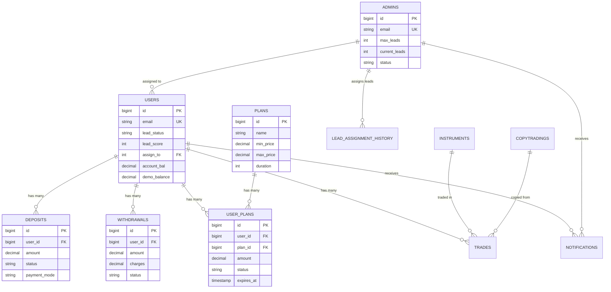

# Monexa Fintech Platform - Database Schema Documentation

## İçindekiler
- [Genel Bakış](#genel-bakış)
- [Temel Tablolar](#temel-tablolar)
- [İlişki Haritası](#i̇lişki-haritası)
- [Performance Optimizations](#performance-optimizations)
- [Migration History](#migration-history)
- [İndeksler ve Constraints](#i̇ndeksler-ve-constraints)

## Genel Bakış

Monexa platformu, **MySQL 8.0+** database kullanarak fintech işlemlerini destekleyen optimize edilmiş bir schema yapısına sahiptir. Schema, 85+ migration'ın consolidation sürecinden geçerek optimize edilmiş ve performance odaklı olarak tasarlanmıştır.

### Schema İstatistikleri
- **Toplam Tablolar**: ~40 tablo
- **Migration Count**: 85+ → Consolidated schema
- **İndeks Sayısı**: 15+ composite index
- **Constraint Sayısı**: Full referential integrity
- **Storage Engine**: InnoDB (transaction support)

## Temel Tablolar

### Core User Management

#### `users` - Ana Kullanıcı Tablosu
```sql
CREATE TABLE users (
    id BIGINT UNSIGNED PRIMARY KEY AUTO_INCREMENT,
    name VARCHAR(255) NOT NULL,
    email VARCHAR(255) UNIQUE NOT NULL,
    email_verified_at TIMESTAMP NULL,
    password VARCHAR(255) NOT NULL,
    phone_code VARCHAR(10),
    phone VARCHAR(20),
    username VARCHAR(255) UNIQUE,
    
    -- Financial Fields
    account_bal DECIMAL(20,2) DEFAULT 0.00,
    bonus DECIMAL(20,2) DEFAULT 0.00,
    ref_bonus DECIMAL(20,2) DEFAULT 0.00,
    demo_balance DECIMAL(20,2) DEFAULT 1000.00,
    
    -- Lead Management Fields
    lead_status VARCHAR(50) DEFAULT 'new',
    lead_score INT DEFAULT 0,
    assign_to INT NULL,
    last_contact_date TIMESTAMP NULL,
    next_follow_up_date TIMESTAMP NULL,
    lead_source VARCHAR(100),
    lead_priority ENUM('low', 'medium', 'high') DEFAULT 'medium',
    
    -- Company Information
    company_name VARCHAR(255),
    company_website VARCHAR(255),
    industry VARCHAR(100),
    company_size ENUM('1-10', '11-50', '51-200', '201-1000', '1000+'),
    
    -- Crypto Wallet Addresses
    btc_address TEXT,
    eth_address TEXT,
    ltc_address TEXT,
    usdt_address TEXT,
    
    -- KYC & Verification
    kyc_status ENUM('pending', 'approved', 'rejected') DEFAULT 'pending',
    is_verified BOOLEAN DEFAULT FALSE,
    two_factor_secret TEXT,
    two_factor_confirmed_at TIMESTAMP NULL,
    
    -- Referral System
    ref_by INT NULL,
    ref_link VARCHAR(255) UNIQUE,
    
    -- Account Status
    status ENUM('active', 'blocked', 'suspended') DEFAULT 'active',
    country VARCHAR(3),
    currency VARCHAR(3) DEFAULT 'USD',
    
    -- Timestamps
    created_at TIMESTAMP DEFAULT CURRENT_TIMESTAMP,
    updated_at TIMESTAMP DEFAULT CURRENT_TIMESTAMP ON UPDATE CURRENT_TIMESTAMP,
    deleted_at TIMESTAMP NULL,
    
    -- Foreign Key Constraints
    FOREIGN KEY (assign_to) REFERENCES admins(id) ON DELETE SET NULL,
    FOREIGN KEY (ref_by) REFERENCES users(id) ON DELETE SET NULL,
    
    -- Indexes for Performance
    INDEX idx_lead_status (lead_status),
    INDEX idx_assign_to (assign_to),
    INDEX idx_email_status (email, status),
    INDEX idx_ref_by (ref_by),
    INDEX idx_lead_score_status (lead_score, lead_status),
    INDEX idx_next_follow_up (next_follow_up_date)
);
```

### Financial Tables

#### `deposits` - Yatırım İşlemleri
```sql
CREATE TABLE deposits (
    id BIGINT UNSIGNED PRIMARY KEY AUTO_INCREMENT,
    user_id BIGINT UNSIGNED NOT NULL,
    amount DECIMAL(20,2) NOT NULL,
    payment_mode VARCHAR(50) NOT NULL, -- crypto, bank, card
    status ENUM('pending', 'approved', 'declined') DEFAULT 'pending',
    currency VARCHAR(3) DEFAULT 'USD',
    
    -- Payment Details
    txn_id VARCHAR(255),
    screenshot VARCHAR(255), -- Payment proof
    
    -- Admin Processing
    admin_note TEXT,
    approved_by INT NULL,
    approved_at TIMESTAMP NULL,
    
    -- Timestamps
    created_at TIMESTAMP DEFAULT CURRENT_TIMESTAMP,
    updated_at TIMESTAMP DEFAULT CURRENT_TIMESTAMP ON UPDATE CURRENT_TIMESTAMP,
    
    -- Foreign Key Constraints
    FOREIGN KEY (user_id) REFERENCES users(id) ON DELETE CASCADE,
    FOREIGN KEY (approved_by) REFERENCES admins(id) ON DELETE SET NULL,
    
    -- Performance Indexes
    INDEX idx_user_status (user_id, status),
    INDEX idx_status_created (status, created_at),
    INDEX idx_payment_mode (payment_mode),
    INDEX idx_txn_id (txn_id)
);
```

#### `withdrawals` - Çekim İşlemleri
```sql
CREATE TABLE withdrawals (
    id BIGINT UNSIGNED PRIMARY KEY AUTO_INCREMENT,
    user_id BIGINT UNSIGNED NOT NULL,
    amount DECIMAL(20,2) NOT NULL,
    charges DECIMAL(20,2) DEFAULT 0.00,
    to_deduct DECIMAL(20,2) NOT NULL,
    payment_mode VARCHAR(50) NOT NULL,
    status ENUM('pending', 'approved', 'declined') DEFAULT 'pending',
    currency VARCHAR(3) DEFAULT 'USD',
    
    -- Withdrawal Details
    wallet_address TEXT,
    bank_details TEXT,
    txn_id VARCHAR(255),
    
    -- Admin Processing
    admin_note TEXT,
    approved_by INT NULL,
    approved_at TIMESTAMP NULL,
    
    -- Timestamps
    created_at TIMESTAMP DEFAULT CURRENT_TIMESTAMP,
    updated_at TIMESTAMP DEFAULT CURRENT_TIMESTAMP ON UPDATE CURRENT_TIMESTAMP,
    
    -- Foreign Key Constraints
    FOREIGN KEY (user_id) REFERENCES users(id) ON DELETE CASCADE,
    FOREIGN KEY (approved_by) REFERENCES admins(id) ON DELETE SET NULL,
    
    -- Performance Indexes
    INDEX idx_user_status (user_id, status),
    INDEX idx_status_created (status, created_at),
    INDEX idx_payment_mode (payment_mode)
);
```

### Investment & Trading Tables

#### `plans` - Yatırım Planları
```sql
CREATE TABLE plans (
    id BIGINT UNSIGNED PRIMARY KEY AUTO_INCREMENT,
    name VARCHAR(255) NOT NULL,
    description TEXT,
    min_price DECIMAL(20,2) NOT NULL,
    max_price DECIMAL(20,2) NOT NULL,
    minr DECIMAL(5,2) NOT NULL, -- Minimum return percentage
    maxr DECIMAL(5,2) NOT NULL, -- Maximum return percentage
    gift DECIMAL(20,2) DEFAULT 0.00, -- Sign-up bonus
    duration INT NOT NULL, -- Days
    increment_type ENUM('fixed', 'percentage') DEFAULT 'percentage',
    increment_amount DECIMAL(20,2) DEFAULT 0.00,
    active BOOLEAN DEFAULT TRUE,
    
    -- Timestamps
    created_at TIMESTAMP DEFAULT CURRENT_TIMESTAMP,
    updated_at TIMESTAMP DEFAULT CURRENT_TIMESTAMP ON UPDATE CURRENT_TIMESTAMP,
    deleted_at TIMESTAMP NULL,
    
    -- Performance Indexes
    INDEX idx_active_price (active, min_price, max_price),
    INDEX idx_duration (duration)
);
```

#### `user_plans` - Kullanıcı Yatırımları
```sql
CREATE TABLE user_plans (
    id BIGINT UNSIGNED PRIMARY KEY AUTO_INCREMENT,
    user_id BIGINT UNSIGNED NOT NULL,
    plan_id BIGINT UNSIGNED NOT NULL,
    amount DECIMAL(20,2) NOT NULL,
    expected_return DECIMAL(20,2) NOT NULL,
    total_return DECIMAL(20,2) DEFAULT 0.00,
    status ENUM('active', 'completed', 'cancelled') DEFAULT 'active',
    
    -- Plan Lifecycle
    activated_at TIMESTAMP NULL,
    expires_at TIMESTAMP NULL,
    completed_at TIMESTAMP NULL,
    
    -- ROI Tracking
    daily_sequence INT DEFAULT 0,
    last_profit_date DATE NULL,
    profit_earned DECIMAL(20,2) DEFAULT 0.00,
    
    -- Timestamps
    created_at TIMESTAMP DEFAULT CURRENT_TIMESTAMP,
    updated_at TIMESTAMP DEFAULT CURRENT_TIMESTAMP ON UPDATE CURRENT_TIMESTAMP,
    
    -- Foreign Key Constraints
    FOREIGN KEY (user_id) REFERENCES users(id) ON DELETE CASCADE,
    FOREIGN KEY (plan_id) REFERENCES plans(id) ON DELETE CASCADE,
    
    -- Performance Indexes
    INDEX idx_user_status (user_id, status),
    INDEX idx_expires_at (expires_at),
    INDEX idx_status_expires (status, expires_at),
    INDEX idx_last_profit_date (last_profit_date)
);
```

### Admin & Lead Management

#### `admins` - Admin Kullanıcıları
```sql
CREATE TABLE admins (
    id BIGINT UNSIGNED PRIMARY KEY AUTO_INCREMENT,
    firstname VARCHAR(100) NOT NULL,
    lastname VARCHAR(100) NOT NULL,
    email VARCHAR(255) UNIQUE NOT NULL,
    phone VARCHAR(20),
    password VARCHAR(255) NOT NULL,
    
    -- Admin Profile
    role_id BIGINT UNSIGNED NULL,
    admin_group_id BIGINT UNSIGNED NULL,
    department VARCHAR(100),
    position VARCHAR(100),
    
    -- Capacity Management
    max_leads INT DEFAULT 50,
    current_leads INT DEFAULT 0,
    
    -- Activity Tracking
    last_seen TIMESTAMP NULL,
    login_count INT DEFAULT 0,
    
    -- Status
    status ENUM('active', 'inactive', 'suspended') DEFAULT 'active',
    
    -- Timestamps
    created_at TIMESTAMP DEFAULT CURRENT_TIMESTAMP,
    updated_at TIMESTAMP DEFAULT CURRENT_TIMESTAMP ON UPDATE CURRENT_TIMESTAMP,
    deleted_at TIMESTAMP NULL,
    
    -- Foreign Key Constraints
    FOREIGN KEY (role_id) REFERENCES roles(id) ON DELETE SET NULL,
    FOREIGN KEY (admin_group_id) REFERENCES admin_groups(id) ON DELETE SET NULL,
    
    -- Performance Indexes
    INDEX idx_status (status),
    INDEX idx_role_id (role_id),
    INDEX idx_admin_group_id (admin_group_id),
    INDEX idx_capacity (current_leads, max_leads)
);
```

#### `lead_assignment_history` - Lead Atama Geçmişi
```sql
CREATE TABLE lead_assignment_history (
    id BIGINT UNSIGNED PRIMARY KEY AUTO_INCREMENT,
    user_id BIGINT UNSIGNED NOT NULL,
    admin_id BIGINT UNSIGNED NOT NULL,
    assigned_by BIGINT UNSIGNED NULL,
    assignment_reason TEXT,
    assigned_at TIMESTAMP DEFAULT CURRENT_TIMESTAMP,
    unassigned_at TIMESTAMP NULL,
    unassignment_reason TEXT,
    
    -- Foreign Key Constraints
    FOREIGN KEY (user_id) REFERENCES users(id) ON DELETE CASCADE,
    FOREIGN KEY (admin_id) REFERENCES admins(id) ON DELETE CASCADE,
    FOREIGN KEY (assigned_by) REFERENCES admins(id) ON DELETE SET NULL,
    
    -- Performance Indexes
    INDEX idx_user_admin (user_id, admin_id),
    INDEX idx_assigned_at (assigned_at),
    INDEX idx_admin_assigned (admin_id, assigned_at)
);
```

### Trading & Copy Trading

#### `copytradings` - Copy Trading Experts
```sql
CREATE TABLE copytradings (
    id BIGINT UNSIGNED PRIMARY KEY AUTO_INCREMENT,
    name VARCHAR(255) NOT NULL,
    country VARCHAR(100),
    about TEXT,
    years_experience INT DEFAULT 0,
    copiers INT DEFAULT 0,
    win_rate DECIMAL(5,2) DEFAULT 0.00,
    monthly_return DECIMAL(8,2) DEFAULT 0.00,
    total_profit DECIMAL(15,2) DEFAULT 0.00,
    risk_score INT DEFAULT 1, -- 1-10 scale
    minimum_copy_amount DECIMAL(10,2) DEFAULT 100.00,
    active BOOLEAN DEFAULT TRUE,
    
    -- Profile
    profile_picture VARCHAR(255),
    strategy TEXT,
    preferred_instruments TEXT,
    
    -- Statistics
    total_trades INT DEFAULT 0,
    successful_trades INT DEFAULT 0,
    followers INT DEFAULT 0,
    
    -- Timestamps
    created_at TIMESTAMP DEFAULT CURRENT_TIMESTAMP,
    updated_at TIMESTAMP DEFAULT CURRENT_TIMESTAMP ON UPDATE CURRENT_TIMESTAMP,
    
    -- Performance Indexes
    INDEX idx_active_winrate (active, win_rate),
    INDEX idx_monthly_return (monthly_return),
    INDEX idx_risk_score (risk_score)
);
```

#### `trades` - Trading İşlemleri
```sql
CREATE TABLE trades (
    id BIGINT UNSIGNED PRIMARY KEY AUTO_INCREMENT,
    user_id BIGINT UNSIGNED NOT NULL,
    instrument_id BIGINT UNSIGNED NOT NULL,
    type ENUM('buy', 'sell') NOT NULL,
    amount DECIMAL(15,2) NOT NULL,
    entry_price DECIMAL(15,8) NOT NULL,
    current_price DECIMAL(15,8) DEFAULT 0,
    exit_price DECIMAL(15,8) NULL,
    profit_loss DECIMAL(15,2) DEFAULT 0.00,
    status ENUM('open', 'closed', 'cancelled') DEFAULT 'open',
    
    -- Trade Details
    leverage DECIMAL(5,2) DEFAULT 1.00,
    stop_loss DECIMAL(15,8) NULL,
    take_profit DECIMAL(15,8) NULL,
    
    -- Copy Trading
    copied_from INT NULL, -- copytrading expert ID
    is_demo BOOLEAN DEFAULT FALSE,
    
    -- Timestamps
    opened_at TIMESTAMP DEFAULT CURRENT_TIMESTAMP,
    closed_at TIMESTAMP NULL,
    
    -- Foreign Key Constraints
    FOREIGN KEY (user_id) REFERENCES users(id) ON DELETE CASCADE,
    FOREIGN KEY (instrument_id) REFERENCES instruments(id) ON DELETE CASCADE,
    
    -- Performance Indexes
    INDEX idx_user_status (user_id, status),
    INDEX idx_instrument_type (instrument_id, type),
    INDEX idx_opened_at (opened_at),
    INDEX idx_demo_status (is_demo, status)
);
```

### Supporting Tables

#### `notifications` - Bildirim Sistemi
```sql
CREATE TABLE notifications (
    id BIGINT UNSIGNED PRIMARY KEY AUTO_INCREMENT,
    user_id BIGINT UNSIGNED NULL,
    admin_id BIGINT UNSIGNED NULL,
    title VARCHAR(255) NOT NULL,
    message TEXT NOT NULL,
    type ENUM('info', 'success', 'warning', 'error') DEFAULT 'info',
    
    -- Notification Details
    source_type VARCHAR(50) NULL, -- deposit, withdrawal, trade, etc.
    source_id BIGINT UNSIGNED NULL,
    action_url VARCHAR(255) NULL,
    
    -- Status
    read BOOLEAN DEFAULT FALSE,
    read_at TIMESTAMP NULL,
    
    -- Timestamps
    created_at TIMESTAMP DEFAULT CURRENT_TIMESTAMP,
    updated_at TIMESTAMP DEFAULT CURRENT_TIMESTAMP ON UPDATE CURRENT_TIMESTAMP,
    
    -- Foreign Key Constraints
    FOREIGN KEY (user_id) REFERENCES users(id) ON DELETE CASCADE,
    FOREIGN KEY (admin_id) REFERENCES admins(id) ON DELETE CASCADE,
    
    -- Performance Indexes
    INDEX idx_user_read (user_id, read),
    INDEX idx_admin_read (admin_id, read),
    INDEX idx_type_created (type, created_at),
    INDEX idx_source (source_type, source_id)
);
```

#### `settings` - Sistem Ayarları
```sql
CREATE TABLE settings (
    id BIGINT UNSIGNED PRIMARY KEY AUTO_INCREMENT,
    name VARCHAR(255) UNIQUE NOT NULL,
    value TEXT NOT NULL,
    description TEXT,
    type ENUM('string', 'integer', 'float', 'boolean', 'json') DEFAULT 'string',
    
    -- Timestamps
    created_at TIMESTAMP DEFAULT CURRENT_TIMESTAMP,
    updated_at TIMESTAMP DEFAULT CURRENT_TIMESTAMP ON UPDATE CURRENT_TIMESTAMP,
    
    -- Performance Indexes
    INDEX idx_name (name)
);
```

## İlişki Haritası

### Primary Relationships



### Referral System Flow
```sql
-- Referral chain example
SELECT 
    u1.name as referrer,
    u2.name as referred,
    u2.ref_bonus as commission_earned
FROM users u1 
JOIN users u2 ON u1.id = u2.ref_by
WHERE u1.id = 1; -- Get all users referred by user 1
```

## Performance Optimizations

### Composite Indexes
```sql
-- Users table optimizations
CREATE INDEX idx_lead_management ON users(lead_status, assign_to, next_follow_up_date);
CREATE INDEX idx_financial_status ON users(status, account_bal);
CREATE INDEX idx_referral_tree ON users(ref_by, created_at);

-- Deposits/Withdrawals optimizations  
CREATE INDEX idx_financial_processing ON deposits(status, created_at, user_id);
CREATE INDEX idx_payment_tracking ON deposits(payment_mode, txn_id);

-- Trading optimizations
CREATE INDEX idx_active_trades ON trades(user_id, status, opened_at);
CREATE INDEX idx_copy_trading ON trades(copied_from, status, profit_loss);

-- Notification optimizations
CREATE INDEX idx_unread_notifications ON notifications(user_id, read, created_at);
```

### Query Optimization Strategies

#### 1. Lead Management Queries
```sql
-- Optimized lead dashboard query
SELECT u.*, a.firstname as admin_name 
FROM users u 
LEFT JOIN admins a ON u.assign_to = a.id 
WHERE u.lead_status IN ('new', 'contacted', 'qualified')
  AND (u.next_follow_up_date <= NOW() OR u.next_follow_up_date IS NULL)
ORDER BY u.lead_score DESC, u.created_at DESC;
```

#### 2. Financial Summary Queries
```sql
-- User financial summary
SELECT 
    u.account_bal,
    COALESCE(SUM(d.amount), 0) as total_deposits,
    COALESCE(SUM(w.amount), 0) as total_withdrawals,
    COUNT(up.id) as active_plans
FROM users u
LEFT JOIN deposits d ON u.id = d.user_id AND d.status = 'approved'
LEFT JOIN withdrawals w ON u.id = w.user_id AND w.status = 'approved'  
LEFT JOIN user_plans up ON u.id = up.user_id AND up.status = 'active'
WHERE u.id = ?
GROUP BY u.id;
```

### Connection Pooling & Caching
```php
// Redis caching strategy
Cache::remember("user_financial_summary_{$userId}", 3600, function () use ($userId) {
    return UserRepository::getFinancialSummary($userId);
});

// Database connection optimization
'mysql' => [
    'read' => [
        'host' => env('DB_READ_HOST', env('DB_HOST', '127.0.0.1')),
    ],
    'write' => [
        'host' => env('DB_WRITE_HOST', env('DB_HOST', '127.0.0.1')),
    ],
    'options' => [
        PDO::ATTR_PERSISTENT => true,
        PDO::ATTR_EMULATE_PREPARES => false,
    ]
]
```

## Migration History

### Consolidation Process (2025-10-31)
- **Before**: 85+ individual migrations
- **After**: [`2025_10_31_120000_consolidate_database_schema.php`](database/migrations/2025_10_31_120000_consolidate_database_schema.php)
- **Benefits**: 
  - Faster fresh installations
  - Reduced migration complexity
  - Optimized schema structure
  - Better performance characteristics

### Key Migration Milestones
1. **2025-01-01**: Lead management system implementation
2. **2025-07-23**: Copy trading features 
3. **2025-09-05**: Demo trading functionality
4. **2025-10-20**: Enhanced lead management
5. **2025-10-31**: Schema consolidation

## İndeksler ve Constraints

### Foreign Key Constraints
```sql
-- Referential integrity maintenance
ALTER TABLE deposits ADD CONSTRAINT fk_deposits_user 
    FOREIGN KEY (user_id) REFERENCES users(id) ON DELETE CASCADE;

ALTER TABLE user_plans ADD CONSTRAINT fk_user_plans_user
    FOREIGN KEY (user_id) REFERENCES users(id) ON DELETE CASCADE;

ALTER TABLE users ADD CONSTRAINT fk_users_referrer
    FOREIGN KEY (ref_by) REFERENCES users(id) ON DELETE SET NULL;
```

### Data Integrity Rules
- **Cascade Delete**: User deletion removes all related financial records
- **Set NULL**: Admin deletion sets assignment fields to NULL
- **Restrict Delete**: Cannot delete plans with active investments

### Backup & Recovery Strategy
```bash
# Daily backup script
mysqldump --single-transaction --routines --triggers \
    monexa_production > backup_$(date +%Y%m%d_%H%M%S).sql

# Point-in-time recovery capability
mysqlbinlog --start-datetime="2025-10-31 10:00:00" \
    --stop-datetime="2025-10-31 11:00:00" \
    mysql-bin.000001 > recovery.sql
```

---

**Son Güncelleme**: 31 Ekim 2025  
**Schema Versiyon**: 3.0 (Consolidated)  
**Next Review**: Q1 2026