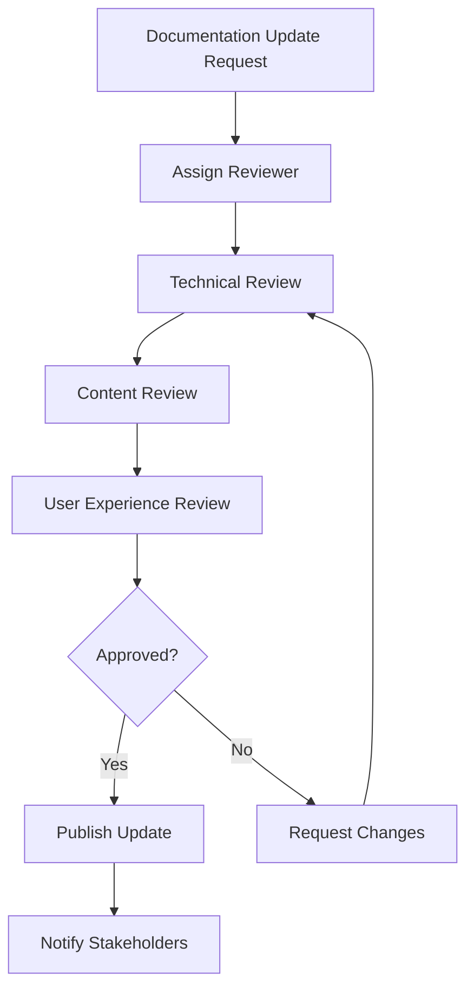

# Monexa Fintech Platform - Documentation Maintenance Schedule

## İçindekiler
- [Genel Bakış](#genel-bakış)
- [Documentation Lifecycle](#documentation-lifecycle)
- [Update Schedule](#update-schedule)
- [Review Process](#review-process)
- [Ownership & Responsibilities](#ownership--responsibilities)
- [Quality Standards](#quality-standards)
- [Automated Maintenance](#automated-maintenance)
- [Change Management](#change-management)
- [Version Control](#version-control)
- [Tools & Workflows](#tools--workflows)

## Genel Bakış

Monexa platform documentation'ının güncel, doğru ve kullanışlı kalması için sistematik bir maintenance schedule uygulanır. Bu schedule, documentation quality'sini sürdürmek ve platform evolution'ı ile sync tutmak için tasarlanmıştır.

### Documentation Categories
- **Technical Documentation**: Architecture, API, Database schemas
- **User Documentation**: Setup guides, troubleshooting, workflows
- **Business Documentation**: Requirements, processes, compliance
- **API Documentation**: Endpoints, integration guides, examples

### Maintenance Principles
- **Accuracy**: Documentation code ile sync olmalı
- **Freshness**: Regular updates ve reviews
- **Accessibility**: Easy to find ve understand
- **Completeness**: Comprehensive coverage
- **Consistency**: Unified style ve format

## Documentation Lifecycle

### Phase 1: Creation
- **Trigger**: New feature development, architecture changes
- **Owner**: Feature developer + Technical Writer
- **Timeline**: Feature completion ile birlikte
- **Deliverables**: Initial documentation draft

### Phase 2: Review & Validation
- **Reviewers**: Senior Developer, Product Manager, QA
- **Timeline**: 2 business days
- **Criteria**: Accuracy, completeness, clarity
- **Deliverables**: Reviewed and approved documentation

### Phase 3: Maintenance
- **Frequency**: Based on update schedule
- **Triggers**: Code changes, user feedback, issues
- **Process**: Update → Review → Publish
- **Tracking**: GitHub issues ve project boards

### Phase 4: Retirement
- **Trigger**: Feature deprecation, major refactoring
- **Process**: Archive old docs, create migration guide
- **Timeline**: 30 days after feature removal

## Update Schedule

### Daily Maintenance
```bash
# Automated checks (CI/CD pipeline)
- Link validation across all documentation
- Code example syntax verification
- API endpoint status checks
- Image/asset availability verification
```

**Automated Tasks**:
- Dead link detection
- API endpoint health checks
- Code snippet validation
- Documentation build status

### Weekly Updates

#### Every Monday
**API Documentation Review** (30 minutes)
- [ ] Verify all endpoints are documented
- [ ] Check response examples for accuracy
- [ ] Update rate limiting information
- [ ] Review authentication methods

**Responsible**: Backend Lead Developer

#### Every Wednesday  
**Component Library Documentation** (45 minutes)
- [ ] New component documentation
- [ ] Updated component examples
- [ ] Accessibility compliance check
- [ ] Browser compatibility updates

**Responsible**: Frontend Lead Developer

#### Every Friday
**User Guide Updates** (60 minutes)  
- [ ] Review user feedback and support tickets
- [ ] Update troubleshooting sections
- [ ] Verify setup instructions
- [ ] Check screenshot currency

**Responsible**: Product Manager + Support Lead

### Monthly Reviews

#### First Week of Month
**Technical Architecture Review** (2 hours)
- [ ] System architecture diagram updates
- [ ] Database schema changes documentation
- [ ] Performance metrics updates  
- [ ] Security configuration reviews
- [ ] Third-party integration status

**Responsible**: Solutions Architect + Senior Backend Developer

#### Second Week of Month
**API Integration Review** (90 minutes)
- [ ] Third-party API documentation updates
- [ ] Integration guide accuracy
- [ ] Error handling documentation
- [ ] Rate limiting ve best practices

**Responsible**: Integration Team Lead

#### Third Week of Month  
**Deployment & Operations Review** (2 hours)
- [ ] Deployment guide updates
- [ ] Environment configuration changes
- [ ] Monitoring ve alerting documentation
- [ ] Backup ve recovery procedures
- [ ] Security compliance updates

**Responsible**: DevOps Lead + SRE Team

#### Fourth Week of Month
**Developer Experience Review** (90 minutes)
- [ ] Setup guide accuracy testing
- [ ] Development workflow documentation  
- [ ] Testing documentation updates
- [ ] Tool ve IDE configuration guides
- [ ] Troubleshooting guide enhancement

**Responsible**: Developer Experience Team

### Quarterly Reviews

#### Q1 Review (January)
**Complete Documentation Audit** (1 week)
- [ ] Content accuracy verification
- [ ] Structure ve organization review
- [ ] User journey mapping
- [ ] Accessibility compliance audit
- [ ] SEO ve discoverability optimization

#### Q2 Review (April)
**Performance & Analytics Review** (3 days)  
- [ ] Documentation usage analytics
- [ ] Search query analysis
- [ ] User feedback compilation
- [ ] Content gap identification
- [ ] Popular content optimization

#### Q3 Review (July)
**Technology Stack Updates** (1 week)
- [ ] Framework version updates
- [ ] Tool ve service documentation
- [ ] Security best practices update
- [ ] Compliance requirement changes
- [ ] Industry standard alignment

#### Q4 Review (October)
**Strategic Documentation Planning** (1 week)
- [ ] Next year planning
- [ ] Resource allocation review
- [ ] Tool ve process evaluation
- [ ] User needs assessment
- [ ] Documentation roadmap update

### Annual Reviews

#### January - Complete Overhaul
**Documentation Architecture Review** (2 weeks)
- [ ] Information architecture redesign
- [ ] Content strategy revision
- [ ] Tool stack evaluation
- [ ] Process improvement implementation
- [ ] Team training ve onboarding

## Review Process

### Standard Review Workflow



### Review Checklist

#### Technical Accuracy (Required for all updates)
- [ ] Code examples compile ve run correctly
- [ ] API endpoints return expected responses  
- [ ] Configuration examples are valid
- [ ] Links point to correct resources
- [ ] Version numbers are current

#### Content Quality
- [ ] Grammar ve spelling are correct
- [ ] Tone is consistent with style guide
- [ ] Content is logically organized
- [ ] Instructions are step-by-step ve clear
- [ ] Examples are relevant ve helpful

#### User Experience
- [ ] Navigation is intuitive
- [ ] Search functionality works
- [ ] Content is mobile-friendly
- [ ] Loading times are acceptable
- [ ] Accessibility standards are met

### Review Assignments

#### Major Updates (New features, architecture changes)
- **Primary Reviewer**: Domain expert (architect, lead developer)
- **Secondary Reviewer**: Technical writer
- **Final Approval**: Product manager

#### Minor Updates (Bug fixes, clarifications)
- **Primary Reviewer**: Feature owner
- **Final Approval**: Team lead

#### Emergency Updates (Critical fixes, security)
- **Fast-track Process**: Immediate review by available senior team member
- **Post-update Review**: Full review within 24 hours

## Ownership & Responsibilities

### Documentation Owners

#### System Architecture (`docs/01-system-architecture.md`)
- **Primary Owner**: Solutions Architect  
- **Secondary Owner**: Senior Backend Developer
- **Review Frequency**: Monthly
- **Update Triggers**: Architecture changes, performance updates

#### Database Schema (`docs/02-database-schema.md`)  
- **Primary Owner**: Database Administrator
- **Secondary Owner**: Backend Lead
- **Review Frequency**: Bi-weekly
- **Update Triggers**: Schema changes, performance optimizations

#### API Documentation (`docs/03-restful-api-documentation.md`)
- **Primary Owner**: Backend Lead Developer
- **Secondary Owner**: API Team
- **Review Frequency**: Weekly  
- **Update Triggers**: New endpoints, API changes, security updates

#### Component Library (`docs/04-component-library-documentation.md`)
- **Primary Owner**: Frontend Lead Developer
- **Secondary Owner**: UI/UX Designer  
- **Review Frequency**: Weekly
- **Update Triggers**: New components, design system changes

#### Developer Setup (`docs/05-developer-setup-guide.md`)
- **Primary Owner**: Developer Experience Engineer
- **Secondary Owner**: Junior Developer (user perspective)
- **Review Frequency**: Monthly
- **Update Triggers**: Tool updates, process changes

#### Deployment Guide (`docs/06-deployment-guide.md`)
- **Primary Owner**: DevOps Lead
- **Secondary Owner**: SRE Team
- **Review Frequency**: Monthly  
- **Update Triggers**: Infrastructure changes, security updates

#### Integration Guide (`docs/07-third-party-integration-guide.md`)
- **Primary Owner**: Integration Team Lead
- **Secondary Owner**: Backend Developer
- **Review Frequency**: Monthly
- **Update Triggers**: New integrations, API updates

#### Troubleshooting Guide (`docs/08-troubleshooting-guide.md`)
- **Primary Owner**: Support Team Lead
- **Secondary Owner**: Senior Developer
- **Review Frequency**: Weekly
- **Update Triggers**: New issues, solution updates

### Team Responsibilities

#### Development Team
- Document new features ve changes
- Review pull requests for documentation impact
- Update code comments ve inline documentation
- Provide technical accuracy reviews

#### Product Team  
- Define documentation requirements for features
- Review user-facing documentation
- Provide business context ve use cases
- Prioritize documentation improvements

#### QA Team
- Verify documentation accuracy during testing
- Test setup ve configuration guides
- Report documentation bugs ve inconsistencies
- Validate user workflows ve scenarios

#### Support Team
- Identify common issues for troubleshooting guide
- Provide user feedback on documentation
- Create FAQ content based on support tickets
- Review user-facing guides for clarity

## Quality Standards

### Writing Standards
- **Language**: Professional but approachable Turkish/English
- **Tone**: Helpful, clear, concise
- **Structure**: Hierarchical with clear headings
- **Examples**: Real, working code examples
- **Links**: Descriptive link text, verified targets

### Technical Standards
- **Code Examples**: Must compile ve run
- **API Examples**: Real request/response pairs
- **Screenshots**: Current, consistent styling
- **Diagrams**: Clear, professional, up-to-date
- **Configuration**: Tested ve verified

### Accessibility Standards
- **WCAG 2.1 AA Compliance**: All documentation
- **Screen Reader Support**: Proper heading structure
- **Color Contrast**: Minimum 4.5:1 ratio
- **Alternative Text**: All images ve diagrams
- **Keyboard Navigation**: Fully navigable

### SEO & Discoverability
- **Meta Descriptions**: All major pages
- **Header Structure**: Logical H1-H6 hierarchy  
- **Internal Linking**: Comprehensive cross-references
- **Search Functionality**: Full-text search capability
- **Sitemap**: Auto-generated ve updated

## Automated Maintenance

### CI/CD Integration
```yaml
# .github/workflows/docs-maintenance.yml
name: Documentation Maintenance

on:
  schedule:
    - cron: '0 2 * * *' # Daily at 2 AM
  push:
    paths:
      - 'docs/**'
      - 'api/**'
      - 'routes/**'

jobs:
  validate-docs:
    runs-on: ubuntu-latest
    steps:
      - name: Check Links
        run: |
          markdown-link-check docs/**/*.md
          
      - name: Validate API Examples  
        run: |
          newman run api-tests.json
          
      - name: Check Code Syntax
        run: |
          find docs -name "*.md" -exec markdown-code-check {} \;
          
      - name: Generate API Docs
        run: |
          php artisan api:generate-docs --update-only
```

### Automated Checks

#### Daily Automated Tasks
```bash
#!/bin/bash
# scripts/daily-docs-maintenance.sh

# Check for broken links
markdown-link-check docs/**/*.md > logs/link-check-$(date +%Y%m%d).log

# Validate API endpoints
curl -f https://api.monexa.app/health-check || echo "API health check failed"

# Check for outdated screenshots
find docs -name "*.png" -mtime +90 > logs/old-screenshots.log

# Verify code examples
for file in docs/**/*.md; do
    extract-code-blocks "$file" | validate-syntax
done
```

#### Weekly Automated Reports
```bash
#!/bin/bash  
# scripts/weekly-docs-report.sh

# Generate documentation metrics
echo "Documentation Update Report - $(date)" > reports/weekly-report.md
echo "=====================================" >> reports/weekly-report.md

# Check update frequency
git log --since="1 week ago" --pretty=format:"%h %s" docs/ >> reports/weekly-report.md

# Identify stale content
find docs -name "*.md" -mtime +30 >> reports/stale-content.log

# Generate usage analytics
curl -s "https://analytics.api.com/docs-usage" | jq '.popular_pages' >> reports/weekly-report.md
```

### Monitoring & Alerts

#### Documentation Health Dashboard
- **Broken Links Count**: Real-time monitoring
- **Last Update Times**: Per document tracking  
- **User Feedback Scores**: Documentation ratings
- **Search Success Rate**: User search analytics
- **Page Load Times**: Performance monitoring

#### Alert Thresholds
- **Critical**: >10 broken links, >5 days since update
- **Warning**: >5 broken links, >3 days since update
- **Info**: User feedback score <4.0/5.0

## Change Management

### Documentation Change Process

#### 1. Change Request
```markdown
## Documentation Change Request

**Type**: [ ] New Content [ ] Update [ ] Deletion [ ] Restructure
**Priority**: [ ] Critical [ ] High [ ] Medium [ ] Low
**Affected Documents**: 
**Reason for Change**:
**Proposed Changes**:
**Impact Assessment**:
**Timeline**:
```

#### 2. Impact Assessment
- **Content Dependencies**: What other docs reference this?
- **User Impact**: How many users will be affected?
- **Technical Impact**: Are system changes required?
- **Resource Requirements**: Time ve people needed

#### 3. Change Approval
- **Minor Changes**: Team lead approval
- **Major Changes**: Product manager + architect approval  
- **Breaking Changes**: Full leadership team approval

#### 4. Implementation
- **Development**: Create/update documentation
- **Review**: Technical ve content review
- **Testing**: Validate all examples ve links
- **Deployment**: Publish changes

#### 5. Communication
- **Internal**: Notify relevant teams
- **External**: User notifications if needed
- **Follow-up**: Monitor for issues ve feedback

### Version Control Strategy

#### Documentation Versioning
```
docs/
├── v1.0/           # Legacy documentation
├── v2.0/           # Previous version  
├── current/        # Current version (symlink to v3.0)
└── v3.0/           # Latest version
    ├── 01-system-architecture.md
    ├── 02-database-schema.md
    └── ...
```

#### Git Workflow
```bash
# Feature branch for documentation updates
git checkout -b docs/update-api-authentication
# Make changes
git add docs/
git commit -m "docs: update API authentication examples"
git push origin docs/update-api-authentication
# Create pull request
```

#### Release Notes Template
```markdown
## Documentation Release v3.1.0

### Added
- New troubleshooting section for payment gateway issues
- Updated component library with 5 new components
- Added deployment checklist for security compliance

### Changed  
- Improved API documentation with more examples
- Updated setup guide for Laravel 12
- Refined database schema documentation

### Fixed
- Corrected broken links in integration guide
- Fixed code examples in authentication section
- Updated outdated screenshots in user guide

### Removed
- Deprecated sections for legacy payment methods
- Outdated troubleshooting entries
```

## Tools & Workflows

### Documentation Stack
- **Authoring**: Markdown with IDE plugins
- **Version Control**: Git with branch protection
- **Review**: GitHub Pull Requests
- **Publishing**: Static site generator (GitBook, VitePress)
- **Analytics**: Google Analytics, user feedback forms
- **Monitoring**: Automated link checking, uptime monitoring

### Recommended Tools

#### Writing & Editing
- **VS Code**: Markdown extensions, spell check
- **Grammarly**: Grammar ve style checking
- **Hemingway Editor**: Readability improvement
- **Notion**: Collaborative planning ve drafting

#### Visual Content
- **Lucidchart**: Architecture diagrams
- **Figma**: UI mockups ve design assets
- **Screenshot tools**: Consistency in visual examples
- **Mermaid**: Code-based diagrams

#### Validation & Testing
- **markdown-link-check**: Broken link detection
- **markdownlint**: Markdown formatting consistency
- **Newman**: API documentation testing
- **Pa11y**: Accessibility testing

### Workflow Automation

#### GitHub Actions Integration
```yaml
name: Documentation Quality Check
on:
  pull_request:
    paths: ['docs/**']

jobs:
  quality-check:
    runs-on: ubuntu-latest
    steps:
      - uses: actions/checkout@v3
      - name: Lint Markdown
        run: markdownlint docs/
      - name: Check Links
        run: markdown-link-check docs/**/*.md  
      - name: Spell Check
        run: cspell "docs/**/*.md"
      - name: Accessibility Check
        run: pa11y-ci --sitemap http://docs.monexa.app/sitemap.xml
```

## Success Metrics

### Documentation Health KPIs
- **Freshness**: Average days since last update per document
- **Accuracy**: User-reported issue rate (<2% target)
- **Completeness**: Feature coverage percentage (>95% target)
- **Usability**: User satisfaction score (>4.5/5 target)
- **Findability**: Search success rate (>80% target)

### Performance Metrics
- **Update Velocity**: Average time from change to documentation update
- **Review Efficiency**: Average review time for documentation changes
- **Quality Score**: Automated quality check pass rate
- **User Engagement**: Page views, time on page, bounce rate

### Quarterly Review Questions
1. Are all major features properly documented?
2. Is the documentation helping users achieve their goals?
3. Are common issues well-covered in troubleshooting?
4. Is the information architecture still logical?
5. Are we meeting our quality ve freshness targets?

---

**Son Güncelleme**: 31 Ekim 2025  
**Next Scheduled Review**: 15 Kasım 2025  
**Document Owner**: Technical Writing Team  
**Approval**: Engineering Leadership Team