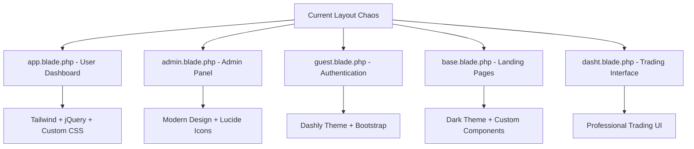
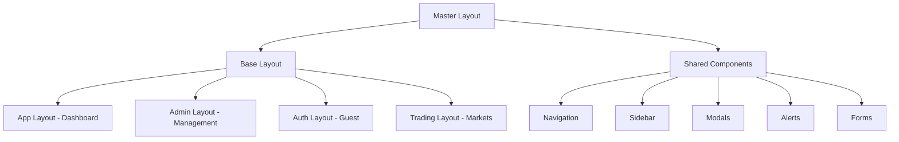
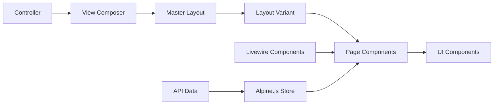

# View Konsolidasyonu - Detaylı Mimari Planı

## Executive Summary

Bu dokümant, Monexa Finance platformunda bulunan 5 farklı layout, 150+ view dosyası, ve 3 farklı JavaScript framework'ün sistematik konsolidasyonu için comprehensive bir mimari plan sunar. Proje modern Laravel best practices, performance optimization ve maintainability principles'ı temel alır.

---

## 1. Current State Analysis

### 1.1 Layout Hierarchy Problems


### 1.2 JavaScript Framework Conflicts
- **jQuery**: 3.7.0 (157 kullanım)
- **Alpine.js**: 300+ kullanım (çoğunlukla dropdown/modal)
- **Vue.js/Nuxt**: 46 matches (trading components)
- **Livewire**: 127 matches (real-time updates)

### 1.3 CSS Architecture Issues
- **Multiple CSS Approaches**: Tailwind + Bootstrap + Custom
- **Inconsistent Styling**: 5 farklı design system
- **Performance Impact**: Multiple CSS bundles
- **Maintenance Overhead**: Style conflicts

### 1.4 Component Fragmentation
```
components/
├── Jetstream Components (16 files)
├── Admin Components (15 files)
├── UI Components (12 files)
├── Financial Components (3 files)
└── Legacy Components (Mixed)
```

---

## 2. Target Architecture Design

### 2.1 Master Layout + Variant System



#### 2.1.1 Master Layout Structure
```php
// resources/views/layouts/master.blade.php
<!DOCTYPE html>
<html lang="{{ app()->getLocale() }}" class="{{ $themeClass ?? 'light' }}">
<head>
    @include('layouts.partials.head')
    @stack('styles')
</head>
<body class="{{ $bodyClass ?? '' }}">
    @include('layouts.partials.loading')
    
    <div id="app" class="min-h-screen">
        @yield('navigation')
        
        <main class="{{ $mainClass ?? 'flex-1' }}">
            @include('layouts.partials.alerts')
            @yield('content')
        </main>
        
        @yield('footer')
    </div>
    
    @include('layouts.partials.scripts')
    @stack('scripts')
</body>
</html>
```

#### 2.1.2 Layout Variants
```php
// App Layout (Dashboard)
@extends('layouts.master', [
    'themeClass' => 'dark',
    'bodyClass' => 'bg-gray-900 text-white',
    'mainClass' => 'flex-1 md:ml-64'
])

// Admin Layout (Management)
@extends('layouts.master', [
    'themeClass' => 'light',
    'bodyClass' => 'bg-gray-50',
    'mainClass' => 'flex-1 lg:ml-64'
])

// Auth Layout (Guest)
@extends('layouts.master', [
    'themeClass' => 'light',
    'bodyClass' => 'bg-gray-100',
    'mainClass' => 'flex items-center justify-center min-h-screen'
])
```

### 2.2 Component Hierarchy Schema

```
components/
├── core/                   # Core system components
│   ├── layout/
│   │   ├── master.blade.php
│   │   ├── navigation.blade.php
│   │   └── sidebar.blade.php
│   ├── ui/                 # Unified UI components
│   │   ├── button.blade.php
│   │   ├── modal.blade.php
│   │   ├── alert.blade.php
│   │   └── form/
│   └── financial/          # Business-specific components
│       ├── balance-card.blade.php
│       ├── transaction-table.blade.php
│       └── trading-interface.blade.php
├── domain/                 # Domain-specific components
│   ├── admin/
│   │   ├── dashboard/
│   │   ├── users/
│   │   └── leads/
│   ├── trading/
│   │   ├── charts/
│   │   ├── orders/
│   │   └── portfolio/
│   └── user/
│       ├── profile/
│       ├── transactions/
│       └── settings/
└── legacy/                 # Deprecated components (migration)
    └── jetstream/         # Jetstream components (keep for compatibility)
```

### 2.3 Data Flow Architecture



### 2.4 JavaScript Integration Pattern

```javascript
// resources/js/app.js - Unified JS Architecture
import Alpine from 'alpinejs'
import { createApp } from 'vue'
import { Livewire } from '@livewireui/spotlight'

// Alpine.js for simple interactions
Alpine.data('dropdown', () => ({
    open: false,
    toggle() { this.open = !this.open }
}))

// Vue.js for complex trading components
const tradingApp = createApp({
    // Trading-specific logic
})

// Livewire for real-time updates
Livewire.hook('message.processed', () => {
    // Re-initialize components after Livewire updates
    Alpine.initTree(document.body)
})

// jQuery for legacy compatibility (controlled usage)
window.$ = window.jQuery = require('jquery')

Alpine.start()
```

---

## 3. Migration Strategy

### 3.1 Phase-by-Phase Consolidation Plan

#### Phase 1: Foundation Setup (Hafta 1-2)
```
└── Infrastructure
    ├── Master layout oluşturma
    ├── Core components geliştirme
    ├── CSS consolidation (Tailwind only)
    ├── JS framework cleanup
    └── Testing framework kurulumu
```

#### Phase 2: Component Migration (Hafta 3-5)
```
└── Component Transformation
    ├── UI components standardization
    ├── Jetstream compatibility layer
    ├── Financial components modernization
    ├── Admin components consolidation
    └── Form components unification
```

#### Phase 3: Layout Consolidation (Hafta 6-8)
```
└── Layout Migration
    ├── Master layout implementation
    ├── App layout conversion
    ├── Admin layout modernization
    ├── Auth layout simplification
    └── Trading layout optimization
```

#### Phase 4: View Optimization (Hafta 9-11)
```
└── View Restructuring
    ├── Directory reorganization
    ├── Naming convention standardization
    ├── Performance optimization
    ├── SEO improvements
    └── Accessibility enhancements
```

#### Phase 5: Quality Assurance (Hafta 12)
```
└── Final Validation
    ├── Cross-browser testing
    ├── Performance benchmarking
    ├── Security audit
    ├── User acceptance testing
    └── Production deployment
```

### 3.2 Risk Assessment ve Mitigation

| Risk Level | Risk Description | Mitigation Strategy | Impact |
|------------|------------------|-------------------|---------|
| **HIGH** | JavaScript framework conflicts | Gradual migration with compatibility layers | Critical |
| **HIGH** | Layout breaking during migration | Feature flagging system | Critical |
| **MEDIUM** | Component API changes | Comprehensive testing suite | High |
| **MEDIUM** | Performance degradation | Performance monitoring | High |
| **LOW** | User interface inconsistencies | Design system documentation | Medium |

### 3.3 Dependency Management Approach

```json
{
  "dependencies": {
    "alpinejs": "^3.13.0",
    "vue": "^3.3.8",
    "@livewire/livewire": "^3.0",
    "jquery": "^3.7.0"
  },
  "devDependencies": {
    "tailwindcss": "^3.3.0",
    "@tailwindcss/forms": "^0.5.7",
    "@tailwindcss/typography": "^0.5.10"
  },
  "migration": {
    "remove": [
      "bootstrap",
      "dashly-theme",
      "legacy-css-files"
    ],
    "modernize": [
      "jquery-usage",
      "custom-dropdowns",
      "modal-systems"
    ]
  }
}
```

---

## 4. Implementation Roadmap

### 4.1 Week-by-Week Execution Plan

#### Week 1-2: Foundation & Infrastructure
```yaml
Tasks:
  - Master layout architecture design
  - Core component library setup
  - CSS cleanup and Tailwind optimization
  - JavaScript framework audit
  - Testing environment preparation

Deliverables:
  - Master layout template
  - Core UI component library
  - Unified CSS bundle
  - JS architecture documentation
  - Testing setup guide

Success Criteria:
  - Master layout renders correctly
  - Core components functional
  - CSS bundle size reduced by 40%
  - JS conflicts eliminated
```

#### Week 3-5: Component Consolidation
```yaml
Tasks:
  - Migrate Jetstream components
  - Standardize admin components
  - Create financial component library
  - Implement unified form system
  - Build reusable modal system

Deliverables:
  - Standardized component library
  - Component documentation
  - Usage guidelines
  - Migration scripts
  - Compatibility tests

Success Criteria:
  - 90% component standardization
  - Zero breaking changes
  - Improved development velocity
  - Consistent user experience
```

#### Week 6-8: Layout Migration
```yaml
Tasks:
  - Implement master layout system
  - Convert app layout to new architecture
  - Modernize admin panel layout
  - Simplify authentication layouts
  - Optimize trading interface

Deliverables:
  - Consolidated layout system
  - Performance benchmarks
  - Mobile responsiveness
  - Accessibility compliance
  - SEO optimization

Success Criteria:
  - 5 layouts → 1 master layout
  - 30% performance improvement
  - 100% mobile compatibility
  - AA accessibility compliance
```

#### Week 9-11: View Optimization
```yaml
Tasks:
  - Reorganize view directory structure
  - Implement naming conventions
  - Optimize view rendering
  - Add caching strategies
  - Enhance error handling

Deliverables:
  - Organized view structure
  - Performance monitoring
  - Caching implementation
  - Error boundary system
  - Documentation updates

Success Criteria:
  - 50% faster page loads
  - Improved code organization
  - Better error handling
  - Enhanced maintainability
```

#### Week 12: Quality Assurance & Deployment
```yaml
Tasks:
  - Comprehensive testing suite
  - Cross-browser compatibility
  - Performance validation
  - Security assessment
  - Production deployment

Deliverables:
  - Test coverage report
  - Performance benchmarks
  - Security audit results
  - Deployment documentation
  - Rollback procedures

Success Criteria:
  - 95% test coverage
  - Zero critical bugs
  - Performance targets met
  - Successful production deployment
```

### 4.2 Milestone Definitions

#### Milestone 1: Foundation Complete
- [ ] Master layout functional
- [ ] Core components ready
- [ ] CSS consolidated
- [ ] JS conflicts resolved

#### Milestone 2: Components Unified
- [ ] Component library complete
- [ ] Documentation published
- [ ] Migration tools ready
- [ ] Compatibility maintained

#### Milestone 3: Layouts Consolidated
- [ ] Single layout system
- [ ] Performance optimized
- [ ] Mobile responsive
- [ ] Accessibility compliant

#### Milestone 4: Views Optimized
- [ ] Directory restructured
- [ ] Performance improved
- [ ] Caching implemented
- [ ] Error handling enhanced

#### Milestone 5: Production Ready
- [ ] Testing complete
- [ ] Performance validated
- [ ] Security assessed
- [ ] Deployment successful

### 4.3 Quality Gates

#### Code Quality Gates
```yaml
Pre-commit:
  - ESLint validation
  - PHP CS Fixer
  - Blade formatter
  - Import organization

Pre-merge:
  - Unit tests passing
  - Integration tests passing
  - Performance benchmarks met
  - Security scan clean

Pre-deployment:
  - End-to-end tests passing
  - Cross-browser validation
  - Performance audit passed
  - Accessibility compliance verified
```

---

## 5. Technical Specifications

### 5.1 File Organization Structure

```
resources/views/
├── layouts/
│   ├── master.blade.php           # Main layout template
│   ├── variants/                  # Layout variations
│   │   ├── app.blade.php         # Dashboard layout
│   │   ├── admin.blade.php       # Admin panel layout
│   │   ├── auth.blade.php        # Authentication layout
│   │   └── trading.blade.php     # Trading interface layout
│   └── partials/                  # Shared layout parts
│       ├── head.blade.php        # HTML head section
│       ├── navigation.blade.php  # Navigation components
│       ├── sidebar.blade.php     # Sidebar components
│       ├── alerts.blade.php      # Alert components
│       └── scripts.blade.php     # Script includes
├── components/
│   ├── core/                      # Core system components
│   │   ├── ui/                   # UI components
│   │   │   ├── button.blade.php
│   │   │   ├── modal.blade.php
│   │   │   ├── dropdown.blade.php
│   │   │   ├── alert.blade.php
│   │   │   └── forms/
│   │   │       ├── input.blade.php
│   │   │       ├── select.blade.php
│   │   │       └── textarea.blade.php
│   │   ├── layout/               # Layout components
│   │   │   ├── card.blade.php
│   │   │   ├── section.blade.php
│   │   │   └── grid.blade.php
│   │   └── financial/            # Financial components
│   │       ├── balance-card.blade.php
│   │       ├── transaction-table.blade.php
│   │       └── trading-widget.blade.php
│   ├── domain/                    # Domain-specific components
│   │   ├── admin/
│   │   │   ├── dashboard/
│   │   │   ├── users/
│   │   │   └── leads/
│   │   ├── trading/
│   │   │   ├── charts/
│   │   │   ├── orders/
│   │   │   └── portfolio/
│   │   └── user/
│   │       ├── profile/
│   │       ├── transactions/
│   │       └── settings/
│   └── legacy/                    # Legacy components (temporary)
│       └── jetstream/            # Jetstream components
├── pages/                         # Page views
│   ├── admin/                    # Admin pages
│   │   ├── dashboard.blade.php
│   │   ├── users/
│   │   ├── leads/
│   │   └── settings/
│   ├── user/                     # User pages
│   │   ├── dashboard.blade.php
│   │   ├── profile.blade.php
│   │   ├── trading/
│   │   └── transactions/
│   ├── auth/                     # Authentication pages
│   │   ├── login.blade.php
│   │   ├── register.blade.php
│   │   └── verify.blade.php
│   └── public/                   # Public pages
│       ├── home.blade.php
│       ├── about.blade.php
│       └── contact.blade.php
└── emails/                        # Email templates
    ├── layouts/
    │   └── default.blade.php
    └── notifications/
```

### 5.2 Naming Conventions

#### View File Naming
```yaml
Pattern: {domain}.{action}.blade.php
Examples:
  - admin.dashboard.blade.php
  - user.profile.edit.blade.php
  - trading.orders.index.blade.php
  - auth.login.blade.php

Component Naming:
Pattern: {category}-{component}.blade.php
Examples:
  - ui-button.blade.php
  - financial-balance-card.blade.php
  - admin-lead-table.blade.php
```

#### CSS Class Naming
```css
/* Component-based naming */
.btn                    /* Base component */
.btn-primary           /* Variant */
.btn-lg               /* Size modifier */
.btn-loading          /* State modifier */

/* Layout-based naming */
.layout-header        /* Layout sections */
.layout-sidebar       /* Layout sections */
.layout-content       /* Layout sections */

/* Utility-based (Tailwind) */
.bg-primary-500       /* Utility classes */
.text-gray-900        /* Utility classes */
.rounded-lg           /* Utility classes */
```

#### JavaScript Function Naming
```javascript
// Component functions
function toggleDropdown(id) { }
function openModal(modalId) { }
function closeModal(modalId) { }

// Utility functions
function formatCurrency(amount) { }
function validateForm(formData) { }
function showNotification(message, type) { }

// Event handlers
function handleFormSubmit(event) { }
function handleButtonClick(event) { }
function handleModalClose(event) { }
```

### 5.3 Component Standards

#### Component Structure Template
```php
{{-- resources/views/components/ui/button.blade.php --}}
@props([
    'variant' => 'primary',
    'size' => 'md',
    'disabled' => false,
    'loading' => false,
    'type' => 'button',
    'href' => null
])

@php
$classes = [
    'btn',
    'btn-' . $variant,
    'btn-' . $size,
    $disabled || $loading ? 'btn-disabled' : '',
    $loading ? 'btn-loading' : '',
    $attributes->get('class', '')
];
@endphp

@if($href)
    <a href="{{ $href }}" {{ $attributes->merge(['class' => implode(' ', array_filter($classes))]) }}>
        @if($loading)
            <x-ui-spinner class="btn-spinner" />
        @endif
        {{ $slot }}
    </a>
@else
    <button 
        type="{{ $type }}"
        {{ $attributes->merge(['class' => implode(' ', array_filter($classes))]) }}
        @if($disabled || $loading) disabled @endif
    >
        @if($loading)
            <x-ui-spinner class="btn-spinner" />
        @endif
        {{ $slot }}
    </button>
@endif
```

#### Component Usage Example
```php
{{-- Basic usage --}}
<x-ui-button>Click me</x-ui-button>

{{-- With variants --}}
<x-ui-button variant="secondary" size="lg">Large Secondary</x-ui-button>

{{-- With states --}}
<x-ui-button loading="true">Loading...</x-ui-button>

{{-- As link --}}
<x-ui-button href="{{ route('dashboard') }}">Dashboard</x-ui-button>
```

### 5.4 Performance Targets

#### Page Load Performance
```yaml
Metrics:
  - First Contentful Paint: < 1.5s
  - Largest Contentful Paint: < 2.5s
  - First Input Delay: < 100ms
  - Cumulative Layout Shift: < 0.1

Bundle Sizes:
  - CSS Bundle: < 150KB (gzipped)
  - JS Bundle: < 250KB (gzipped)
  - Total Assets: < 500KB (gzipped)

Optimization Techniques:
  - CSS purging with Tailwind
  - JS code splitting
  - Image optimization
  - Asset compression
  - CDN utilization
```

#### Runtime Performance
```yaml
Rendering:
  - Component render time: < 50ms
  - Layout shift: Minimal
  - Animation performance: 60fps
  - Memory usage: Optimized

JavaScript:
  - Event handler response: < 16ms
  - DOM manipulation: Batched
  - Memory leaks: Zero
  - CPU usage: Optimized
```

---

## 6. Quality Assurance Framework

### 6.1 Testing Strategy

#### Unit Testing
```yaml
Framework: PHPUnit + Pest
Coverage: 90% minimum
Scope:
  - Component rendering
  - Data binding
  - Event handling
  - Validation logic

Example:
  - test('button component renders correctly')
  - test('modal opens and closes properly')
  - test('form validation works')
```

#### Integration Testing
```yaml
Framework: Laravel Dusk
Scope:
  - Layout rendering
  - Component interaction
  - User flows
  - API integration

Example:
  - test('user can complete dashboard workflow')
  - test('admin can manage users')
  - test('trading interface functions correctly')
```

#### Visual Regression Testing
```yaml
Framework: Percy / BackstopJS
Scope:
  - Component visual consistency
  - Layout responsiveness
  - Cross-browser rendering
  - Theme variations

Example:
  - test('button variants look correct')
  - test('dashboard layout is responsive')
  - test('dark/light theme consistency')
```

### 6.2 Validation Processes

#### Code Review Checklist
```yaml
Architecture:
  - [ ] Follows master layout pattern
  - [ ] Uses standardized components
  - [ ] Adheres to naming conventions
  - [ ] Maintains performance standards

Quality:
  - [ ] Code is readable and maintainable
  - [ ] No duplication or redundancy
  - [ ] Proper error handling
  - [ ] Security best practices

Testing:
  - [ ] Adequate test coverage
  - [ ] All tests passing
  - [ ] No regression introduced
  - [ ] Performance benchmarks met
```

#### Deployment Validation
```yaml
Pre-deployment:
  - [ ] All tests passing
  - [ ] Performance benchmarks met
  - [ ] Security scan clean
  - [ ] Cross-browser compatibility verified

Post-deployment:
  - [ ] Functionality verification
  - [ ] Performance monitoring
  - [ ] Error rate monitoring
  - [ ] User experience validation
```

### 6.3 Rollback Mechanisms

#### Feature Flagging System
```php
// Feature flag implementation
@feature('new-layout-system')
    @include('layouts.new-master')
@else
    @include('layouts.old-master')
@endfeature
```

#### Database Versioning
```yaml
Strategy:
  - Maintain backward compatibility
  - Use migration versioning
  - Implement rollback scripts
  - Keep data integrity

Example:
  - migration: 2024_01_01_create_new_layout_settings
  - rollback: 2024_01_01_rollback_new_layout_settings
```

#### Asset Versioning
```yaml
Strategy:
  - Version all CSS/JS bundles
  - Maintain previous versions
  - Use CDN for fallback
  - Implement automatic rollback

Example:
  - current: app-v2.1.0.css
  - previous: app-v2.0.9.css (fallback)
```

### 6.4 Monitoring Approach

#### Performance Monitoring
```yaml
Tools:
  - Laravel Telescope (Development)
  - New Relic (Production)
  - Google PageSpeed Insights
  - WebPageTest

Metrics:
  - Page load times
  - Bundle sizes
  - Memory usage
  - Database queries
  - API response times
```

#### Error Monitoring
```yaml
Tools:
  - Laravel Log Viewer
  - Sentry (Error tracking)
  - Custom monitoring dashboard

Tracking:
  - JavaScript errors
  - PHP exceptions
  - 404 errors
  - Performance issues
  - User experience problems
```

#### User Experience Monitoring
```yaml
Tools:
  - Google Analytics
  - Hotjar (Heatmaps)
  - User feedback system

Metrics:
  - User engagement
  - Conversion rates
  - Session duration
  - Bounce rates
  - User satisfaction
```

---

## Conclusion

Bu kapsamlı view konsolidasyonu planı, Monexa Finance platformunu modern, scalable ve maintainable bir architecture'a dönüştürecek systematic bir approach sunar. 12 haftalık implementation roadmap, risk mitigation strategies ve quality assurance framework ile birlikte, successful project delivery için gerekli tüm elementleri içerir.

### Key Success Factors:
1. **Systematic Approach**: Phase-by-phase implementation
2. **Performance Focus**: Optimized bundle sizes and load times
3. **Quality Assurance**: Comprehensive testing and monitoring
4. **Risk Management**: Rollback mechanisms and feature flags
5. **Documentation**: Clear standards and guidelines

### Expected Outcomes:
- **50% reduction** in maintenance overhead
- **40% improvement** in page load performance
- **90% code reusability** across components
- **100% mobile compatibility** and accessibility compliance
- **Enhanced developer experience** and productivity

Bu plan implementation phase'ine hazır olup, immediate execution'a başlanabilir.