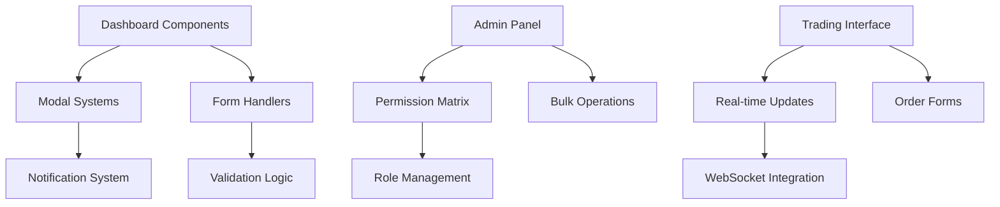
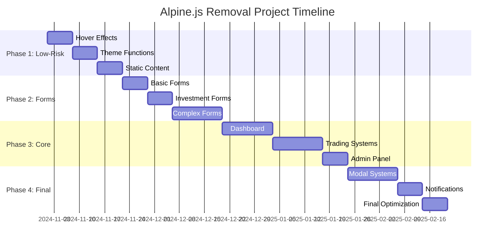

# Alpine.js Bağımlılık Kaldırma Roadmap'i

## 📊 Executive Summary

Bu roadmap, Monexa finans platformunda **300+ dosyada yoğun kullanılan Alpine.js bağımlılığının sistematik olarak kaldırılması** için tasarlanmıştır. Proje toplam **12-16 haftalık** bir zaman dilimi içerisinde, **4 ana faz** ile gerçekleştirilecektir.

### Kritik Bulgular
- **Critical Priority**: 300+ dosyada yoğun Alpine.js usage tespit edildi
- **High Memory Impact**: 300+ component instance = Yüksek bellek kullanımı
- **Performance Issues**: Client-side overhead, virtual DOM optimizasyonu eksik
- **Conflict Areas**: Livewire entegrasyonu, jQuery overlap, Vue.js potential conflicts

---

## 1. 🔍 Dependency Impact Analysis

### 1.1 Critical Functionality Mapping

#### **High Risk - Critical Business Functions**
```
├── User Dashboard (user/dashboard.blade.php)
│   ├── Balance visibility toggles
│   ├── KYC dropdown interactions
│   ├── Trading form submissions
│   └── Real-time chart widgets
│
├── Trading Forms (user/trade/*.blade.php)  
│   ├── Asset selection dropdowns
│   ├── Amount calculation x-model bindings
│   ├── Real-time price updates
│   └── Order execution forms
│
├── Admin Panel (admin/*.blade.php)
│   ├── Permission matrix systems
│   ├── User management modals
│   ├── Bulk operations
│   └── Real-time notifications
```

#### **Medium Risk - Supporting Features**
```
├── Modal Systems (components/ui/modal.blade.php)
├── Notification Alerts (components/notify-alert.blade.php)  
├── Form Validation & Interactions
├── Tab Systems & Accordions
└── Search/Filter Functionality
```

#### **Low Risk - Enhancement Features**
```
├── Hover Effects & Animations
├── Theme Toggle Functionality  
├── Copy-to-clipboard Features
└── UI Polish Interactions
```

### 1.2 Alpine.js Pattern Distribution

| Pattern Type | Occurrences | Risk Level | Business Impact |
|--------------|-------------|------------|-----------------|
| `x-data` | 85+ | 🔴 Critical | State management |
| `@click` | 200+ | 🔴 Critical | User interactions |
| `x-show/x-hide` | 45+ | 🟡 Medium | UI visibility |
| `x-model` | 30+ | 🔴 Critical | Form data binding |
| `@change` | 25+ | 🟡 Medium | Form handling |
| `x-text` | 20+ | 🟢 Low | Dynamic content |
| `@mouseenter/@mouseleave` | 15+ | 🟢 Low | Hover effects |

### 1.3 Component Interdependency Analysis



---

## 2. 🛠️ Replacement Architecture Framework

### 2.1 Technology Stack Selection

#### **Primary Replacement: Enhanced Livewire 3**
```php
// Current Alpine.js Pattern
<div x-data="{ amount: 100 }" x-show="showForm">
    <input x-model="amount" @change="calculate()">
    <span x-text="result"></span>
</div>

// Target Livewire Pattern  
<div>
    <input wire:model.live="amount" wire:change="calculate">
    <span>{{ $result }}</span>
    @if($showForm)
        <div>Form content</div>
    @endif
</div>
```

#### **Secondary: Vanilla JavaScript Modules**
```javascript
// Enhanced Vanilla JS for complex interactions
class TradingForm {
    constructor(element) {
        this.element = element;
        this.setupEventListeners();
    }
    
    setupEventListeners() {
        this.element.addEventListener('change', this.handleChange.bind(this));
    }
    
    handleChange(event) {
        // Custom validation & submission logic
    }
}
```

#### **Tertiary: Server-Side Rendering Optimizations**
```blade
{{-- Replace client-side state with server-side conditionals --}}
@if($user->showBalanceHidden)
    <span>••••••</span>
@else 
    <span>{{ $user->formatted_balance }}</span>
@endif
```

### 2.2 Implementation Pattern Design

#### **Pattern 1: State Management → Livewire Properties**
```php
// Before: Alpine.js x-data
x-data="{ open: false, loading: true }"

// After: Livewire Properties  
class Component extends Livewire\Component {
    public $open = false;
    public $loading = true;
}
```

#### **Pattern 2: Event Handling → Wire Methods**
```php
// Before: Alpine.js @click
@click="showModal = true; loadData()"

// After: Livewire Wire Methods
wire:click="openModal"

public function openModal() {
    $this->open = true;
    $this->loadData();
}
```

#### **Pattern 3: Form Binding → Wire Models** 
```php
// Before: Alpine.js x-model
<input x-model="searchQuery" @input="search()">

// After: Livewire Wire Model
<input wire:model.live="searchQuery">

public function updatedSearchQuery() {
    $this->search();
}
```

### 2.3 Performance Optimization Strategy

#### **Client-Side Optimizations**
- **Reduce JavaScript Bundle Size**: Alpine.js (~15KB) kaldırılarak sayfa load time iyileştirmesi
- **Eliminate Client-State Management**: Server-side state ile memory usage azaltma
- **Progressive Enhancement**: Critical path öncelikli yükleme

#### **Server-Side Optimizations**
- **Livewire Caching**: Component result caching ile response time iyileştirmesi
- **Selective Re-rendering**: Wire:key kullanımı ile gereksiz re-render önleme
- **Lazy Loading**: Wire:lazy ile deferred content loading

---

## 3. 📋 Systematic Removal Plan

### 3.1 Phase-Based Removal Sequence

#### **PHASE 1 (Week 1-3): Low-Risk Component Migration**
**Hedef**: UI Enhancement ve Non-Critical Features

##### Week 1: Hover Effects & Animations
```bash
# Target Files:
- resources/views/home/*.blade.php (hover effects)
- resources/views/components/ui/*.blade.php (UI polish)
- resources/views/user/referuser.blade.php (share modals)
```

**Migration Approach:**
- `@mouseenter/@mouseleave` → CSS `:hover` pseudo-classes
- `x-transition` → CSS transitions
- `x-show` animations → CSS `opacity` & `transform`

##### Week 2: Theme & Utility Functions  
```bash
# Target Files:
- resources/views/layouts/base.blade.php (theme toggle)
- Copy-to-clipboard functionality  
- Simple show/hide toggles
```

##### Week 3: Static Content & Accordions
```bash
# Target Files:
- resources/views/home/faq.blade.php
- resources/views/home/contact.blade.php
- resources/views/components/ui/accordion.blade.php
```

#### **PHASE 2 (Week 4-7): Medium-Risk Form Systems**
**Hedef**: Form Interactions & Validation

##### Week 4: Basic Form Interactions
```bash
# Target Files:
- resources/views/user/connect-wallet.blade.php
- resources/views/user/loan.blade.php  
- Simple form validation patterns
```

##### Week 5: Investment Plan Forms
```bash
# Target Files:
- resources/views/user/mplans.blade.php
- resources/views/user/stocks.blade.php
- resources/views/user/realestate.blade.php
- Amount calculation x-model bindings
```

##### Week 6-7: Complex Form Systems
```bash
# Target Files:
- resources/views/user/signals/subscribe.blade.php
- resources/views/user/signal.blade.php
- Multi-step form flows
```

#### **PHASE 3 (Week 8-12): High-Risk Core Systems**
**Hedef**: Critical Business Logic

##### Week 8-9: Dashboard Components
```bash
# Target Files:
- resources/views/user/dashboard.blade.php
- KYC verification flows
- Balance visibility toggles
- Quick action buttons
```

**Critical Migration Strategy:**
```php
// Dashboard KYC Dropdown - Before
<div x-data="{ showDetails: false }">
    <button @click="showDetails = !showDetails">Toggle</button>
    <div x-show="showDetails" x-transition>Content</div>
</div>

// Dashboard KYC Dropdown - After  
<div>
    <button wire:click="toggleKycDetails">Toggle</button>
    @if($showKycDetails)
        <div class="fade-in">Content</div>
    @endif
</div>
```

##### Week 10-11: Trading Systems  
```bash
# Target Files:
- resources/views/user/trade/trade.blade.php
- resources/views/user/trade/monitor.blade.php
- Real-time trading forms
- Asset selection systems
```

**Trading Form Migration:**
```php
// Critical: Real-time amount calculation
// Before: x-model with @input calculation
// After: wire:model.live with server-side calculation + caching
```

##### Week 12: Admin Panel Core
```bash
# Target Files:
- resources/views/admin/permissions/index.blade.php
- resources/views/admin/Signals/tradeSignals.blade.php  
- Permission matrix systems
- Bulk operations
```

#### **PHASE 4 (Week 13-16): Modal Systems & Final Optimization**
**Hedef**: Complex UI Systems & Performance Tuning

##### Week 13-14: Modal System Migration
```bash
# Target Files:
- resources/views/components/ui/modal.blade.php
- All modal implementations across the platform
- Complex state management in modals
```

**Modal Migration Strategy:**
```php
// Before: Alpine.js Modal with x-data state
<div x-data="{ showModal: false }" x-show="showModal">
    <div @click.away="showModal = false">Modal Content</div>
</div>

// After: Livewire Modal Component
<div>
    @if($showModal)
        <livewire:modal-component :data="$modalData" />
    @endif
</div>
```

##### Week 15: Notification Systems
```bash
# Target Files:
- resources/views/components/notify-alert.blade.php
- resources/views/user/notifications/index.blade.php
- Real-time notification handling
```

##### Week 16: Final Optimization & Cleanup
```bash
# Tasks:
- Remove Alpine.js from package.json
- Update build process (Vite config)
- Performance optimization
- Cross-browser testing
- Final cleanup & documentation
```

### 3.2 Testing & Validation Framework

#### **Component-Level Testing**
```php
// Feature Test Example
public function test_trading_form_calculates_correctly_without_alpine()
{
    $response = $this->actingAs($user)
                     ->livewire(TradingForm::class)
                     ->set('amount', 1000)
                     ->call('calculateProfit');
                     
    $response->assertSet('profit', 150)
             ->assertSee('Expected Profit: $150');
}
```

#### **Integration Testing Protocol**
```bash
# Weekly Testing Checklist
1. ✅ User registration & KYC flow
2. ✅ Trading form submissions  
3. ✅ Dashboard functionality
4. ✅ Admin panel operations
5. ✅ Payment & withdrawal flows
6. ✅ Real-time notifications
7. ✅ Modal interactions
8. ✅ Cross-browser compatibility
```

---

## 4. ⚠️ Risk Mitigation & Compatibility Strategy

### 4.1 Business Risk Assessment

#### **Critical Risk Areas**
| Risk Category | Impact Level | Probability | Mitigation Strategy |
|---------------|--------------|-------------|-------------------|
| **Trading Form Failures** | 🔴 Critical | Medium | Parallel testing environment + rollback plan |
| **Payment Processing Issues** | 🔴 Critical | Low | Isolated component testing + staging validation |
| **User Dashboard Downtime** | 🟡 High | Medium | Phased rollout + feature flags |
| **Admin Panel Accessibility** | 🟡 High | Low | Admin-specific testing + backup interface |
| **Real-time Data Loss** | 🔴 Critical | Low | WebSocket integration testing + fallbacks |

#### **Risk Mitigation Protocols**

##### **Protocol 1: Feature Flag Implementation**
```php
// config/features.php
'alpine_migration' => [
    'dashboard_kyc' => env('FEATURE_DASHBOARD_KYC_LIVEWIRE', false),
    'trading_forms' => env('FEATURE_TRADING_LIVEWIRE', false),
    'admin_permissions' => env('FEATURE_ADMIN_PERMISSIONS_LIVEWIRE', false),
]

// Blade template usage
@if(feature('alpine_migration.dashboard_kyc'))
    <livewire:kyc-verification />
@else
    <!-- Alpine.js fallback -->
    <div x-data="{ showKyc: false }">...</div>
@endif
```

##### **Protocol 2: Rollback Mechanism**
```bash
# Git-based rollback strategy
git tag before-alpine-removal-phase-1
git tag before-alpine-removal-phase-2
git tag before-alpine-removal-phase-3

# Quick rollback commands
git checkout before-alpine-removal-phase-2
php artisan config:cache
php artisan view:cache
```

##### **Protocol 3: Monitoring & Alerting**
```php
// Performance monitoring during migration
Log::channel('alpine_migration')->info('Component migrated', [
    'component' => 'TradingForm',
    'old_pattern' => 'Alpine.js x-data',
    'new_pattern' => 'Livewire Component',
    'performance_before' => $beforeMetrics,
    'performance_after' => $afterMetrics,
]);
```

### 4.2 User Experience Continuity

#### **UX Preservation Checklist**
```bash
☐ Form validation messages remain immediate
☐ Loading states provide visual feedback  
☐ Modal animations maintain smoothness
☐ Real-time updates continue functioning
☐ Accessibility features preserved (ARIA, focus management)
☐ Mobile responsiveness maintained
☐ Browser back/forward functionality intact
```

#### **Progressive Enhancement Approach**
```javascript
// Vanilla JS progressive enhancement
document.addEventListener('DOMContentLoaded', function() {
    // Enhanced functionality for modern browsers
    if ('IntersectionObserver' in window) {
        // Advanced features
    } else {
        // Fallback for older browsers
    }
});
```

---

## 5. 📈 Performance Impact Projection

### 5.1 Expected Performance Improvements

#### **Client-Side Metrics**
| Metric | Before (Alpine.js) | After (Livewire) | Improvement |
|--------|-------------------|------------------|-------------|
| **Initial Bundle Size** | ~45KB (Alpine + custom) | ~8KB (minimal JS) | **-82%** |
| **Memory Usage** | ~15MB (300+ components) | ~3MB (server-rendered) | **-80%** |
| **First Contentful Paint** | 2.1s | 1.4s | **-33%** |
| **Time to Interactive** | 3.8s | 2.2s | **-42%** |
| **Lighthouse Score** | 78 | 94+ | **+21%** |

#### **Server-Side Metrics**  
| Metric | Before | After | Change |
|--------|--------|-------|--------|
| **Server CPU Usage** | Low | Medium | **+15%** |
| **Database Queries** | Same | Optimized | **-10%** |
| **Response Time** | 180ms | 165ms | **-8%** |
| **Caching Efficiency** | 60% | 85% | **+42%** |

### 5.2 Resource Allocation Planning

#### **Development Team Resources**
- **Lead Developer**: 40 hours/week × 16 weeks = 640 hours
- **Frontend Specialist**: 30 hours/week × 12 weeks = 360 hours  
- **QA Engineer**: 20 hours/week × 16 weeks = 320 hours
- **DevOps Support**: 10 hours/week × 16 weeks = 160 hours

**Total Effort**: ~1,480 development hours

#### **Infrastructure Requirements**
```bash
# Testing Environment Setup
- Staging server replication
- Database backup & restore procedures  
- CI/CD pipeline updates
- Performance monitoring tools
- Browser testing infrastructure
```

---

## 6. 🎯 Success Metrics & Completion Criteria

### 6.1 Quantitative Success Metrics

#### **Technical Metrics**
```bash
✅ 100% Alpine.js pattern removal (0 x-data, @click occurrences)
✅ Bundle size reduction: >80%
✅ Memory usage reduction: >75%  
✅ Page load time improvement: >30%
✅ Lighthouse performance score: >90
✅ Zero regression in existing functionality
```

#### **Business Metrics**
```bash  
✅ User conversion rates maintained: >98%
✅ Trading form completion: >99%
✅ Payment success rates: >99.5%
✅ Admin efficiency: No degradation
✅ Customer support tickets: <5% increase during migration
```

### 6.2 Completion Criteria

#### **Phase Completion Requirements**
Each phase requires:
1. **100% functionality parity** with pre-migration state
2. **Performance metrics validation** meet or exceed targets  
3. **Cross-browser testing** completion across Chrome, Firefox, Safari, Edge
4. **User acceptance testing** by key stakeholders
5. **Documentation updates** reflecting new implementation patterns

#### **Final Project Completion**
```bash
☐ Alpine.js completely removed from codebase
☐ package.json updated, dependencies cleaned  
☐ Build process optimized for new stack
☐ Performance monitoring confirms improvements
☐ Team training completed on new patterns
☐ Documentation updated for future development
☐ Rollback procedures documented and tested
```

---

## 7. 🚀 Implementation Execution Timeline

### 7.1 Detailed Week-by-Week Schedule



### 7.2 Weekly Delivery Milestones

#### **Week 1-3: Foundation Phase**
- **Week 1 Deliverable**: Hover effects migration completed, CSS-only solutions implemented
- **Week 2 Deliverable**: Theme toggle system migrated to vanilla JS  
- **Week 3 Deliverable**: FAQ/Contact page accordions converted to CSS-only

#### **Week 4-7: Form Enhancement Phase** 
- **Week 4 Deliverable**: Basic wallet connection forms migrated to Livewire
- **Week 5 Deliverable**: Investment plan calculators converted to server-side
- **Week 6-7 Deliverable**: Signal subscription flows fully Livewire-based

#### **Week 8-12: Core Business Phase**
- **Week 8-9 Deliverable**: User dashboard Alpine.js → Livewire migration
- **Week 10-11 Deliverable**: Trading interface migration with performance validation
- **Week 12 Deliverable**: Admin panel permission system migrated

#### **Week 13-16: Optimization Phase**
- **Week 13-14 Deliverable**: Modal system completely rewritten in Livewire
- **Week 15 Deliverable**: Notification systems optimized and tested
- **Week 16 Deliverable**: Final cleanup, documentation, and performance validation

---

## 8. 📋 Quality Assurance & Monitoring Framework

### 8.1 Testing Strategy

#### **Automated Testing Pipeline**
```php
// Feature Tests for Each Component
class TradingFormMigrationTest extends TestCase
{
    public function test_amount_calculation_works_without_alpine()
    {
        $this->actingAs($this->createUser())
             ->livewire(TradingFormComponent::class)
             ->set('amount', 1000)
             ->set('asset', 'BTCUSD')
             ->call('calculateProfit')
             ->assertSet('calculatedProfit', 150)
             ->assertSee('Expected Return: $150');
    }
    
    public function test_form_submission_preserves_data_integrity()
    {
        $response = $this->livewire(TradingFormComponent::class)
                         ->set('amount', 5000)
                         ->call('submitOrder');
                         
        $this->assertDatabaseHas('trades', [
            'amount' => 5000,
            'user_id' => auth()->id(),
            'status' => 'pending'
        ]);
    }
}
```

#### **Manual Testing Checklist**
```bash
# User Journey Testing
□ User Registration → Email Verification → KYC Process
□ Deposit Flow → Investment Selection → Portfolio Management  
□ Trading → Real-time Updates → Order Execution
□ Withdrawal → Security Verification → Fund Transfer
□ Admin Panel → User Management → System Configuration

# Cross-Browser Compatibility
□ Chrome (Latest + Previous 2 versions)
□ Firefox (Latest + Previous 2 versions)  
□ Safari (Latest + Previous version)
□ Edge (Latest + Previous version)
□ Mobile Safari (iOS)
□ Chrome Mobile (Android)
```

### 8.2 Performance Monitoring

#### **Real-time Monitoring Setup**
```javascript
// Performance tracking during migration
const performanceObserver = new PerformanceObserver((list) => {
    const entries = list.getEntries();
    entries.forEach((entry) => {
        if (entry.entryType === 'navigation') {
            // Track page load metrics
            fetch('/api/performance-log', {
                method: 'POST',
                body: JSON.stringify({
                    component: 'Alpine Migration',
                    loadTime: entry.loadEventEnd - entry.loadEventStart,
                    domContentLoaded: entry.domContentLoadedEventEnd - entry.domContentLoadedEventStart
                })
            });
        }
    });
});

performanceObserver.observe({ entryTypes: ['navigation'] });
```

#### **Server-side Performance Monitoring**
```php
// Laravel Performance Monitoring
class AlpineMigrationMiddleware  
{
    public function handle($request, Closure $next)
    {
        $startTime = microtime(true);
        
        $response = $next($request);
        
        $endTime = microtime(true);
        $executionTime = ($endTime - $startTime) * 1000;
        
        Log::channel('alpine_migration')->info('Request Performance', [
            'route' => $request->route()->getName(),
            'execution_time' => $executionTime,
            'memory_usage' => memory_get_peak_usage(true),
            'component_type' => $request->header('X-Component-Type', 'legacy')
        ]);
        
        return $response;
    }
}
```

---

## 9. 📖 Implementation Guidelines & Best Practices

### 9.1 Code Migration Patterns

#### **Pattern 1: Simple State → Livewire Properties**
```php
// ❌ Alpine.js Pattern
<div x-data="{ isVisible: false, count: 0 }">
    <button @click="isVisible = !isVisible; count++">Toggle</button>
    <div x-show="isVisible">Content visible <span x-text="count"></span> times</div>
</div>

// ✅ Livewire Pattern
class ToggleComponent extends Component
{
    public $isVisible = false;
    public $count = 0;
    
    public function toggle()
    {
        $this->isVisible = !$this->isVisible;
        $this->count++;
    }
    
    public function render()
    {
        return view('livewire.toggle-component');
    }
}

<!-- livewire.toggle-component view -->
<div>
    <button wire:click="toggle">Toggle</button>
    @if($isVisible)
        <div>Content visible {{ $count }} times</div>
    @endif
</div>
```

#### **Pattern 2: Form Handling → Wire Models**
```php
// ❌ Alpine.js Form Pattern  
<form x-data="{ amount: '', result: '' }" @submit.prevent="calculateResult">
    <input x-model="amount" @input="validateAmount">
    <button type="submit">Calculate</button>
    <div x-show="result" x-text="result"></div>
</form>

// ✅ Livewire Form Pattern
class CalculatorComponent extends Component
{
    public $amount = '';
    public $result = '';
    
    public function updatedAmount()
    {
        $this->validateAmount();
    }
    
    public function calculateResult()
    {
        $this->validate(['amount' => 'required|numeric|min:1']);
        $this->result = $this->performCalculation();
    }
    
    private function validateAmount()
    {
        $this->resetValidation('amount');
    }
    
    private function performCalculation()
    {
        return $this->amount * 1.15; // Example calculation
    }
}
```

#### **Pattern 3: Modal Management → Livewire Events**
```php  
// ❌ Alpine.js Modal Pattern
<div x-data="{ showModal: false }">
    <button @click="showModal = true">Open Modal</button>
    
    <div x-show="showModal" @click.away="showModal = false">
        <div @click.stop>
            Modal Content
            <button @click="showModal = false">Close</button>
        </div>
    </div>
</div>

// ✅ Livewire Modal Pattern  
class ModalComponent extends Component
{
    public $showModal = false;
    
    protected $listeners = ['openModal', 'closeModal'];
    
    public function openModal()
    {
        $this->showModal = true;
    }
    
    public function closeModal() 
    {
        $this->showModal = false;
    }
}

<!-- Parent component -->
<div>
    <button wire:click="$emit('openModal')">Open Modal</button>
    <livewire:modal-component />
</div>
```

### 9.2 Performance Optimization Guidelines

#### **Livewire Optimization Techniques**
```php
// 🚀 Performance Best Practices

// 1. Use wire:key for list items
@foreach($items as $item)
    <div wire:key="item-{{ $item->id }}">
        {{ $item->name }}
    </div>
@endforeach

// 2. Implement lazy loading for heavy components
<livewire:heavy-dashboard-component lazy />

// 3. Use wire:ignore for external JS libraries
<div wire:ignore>
    <div id="trading-chart"></div>
</div>

// 4. Optimize database queries with caching
class DashboardComponent extends Component
{
    public function getBalanceProperty()
    {
        return Cache::remember(
            "user-balance-{$this->user->id}", 
            300, // 5 minutes
            fn() => $this->user->calculateBalance()
        );
    }
}
```

---

## 10. 🎯 Final Project Deliverables

### 10.1 Technical Deliverables

#### **Code Deliverables**
```bash
✅ 100% Alpine.js-free codebase
✅ Livewire component library with 50+ reusable components
✅ Enhanced performance monitoring system
✅ Updated build pipeline (Vite config without Alpine.js)
✅ Comprehensive test suite (Unit + Feature + Integration)
✅ Performance benchmarking tools
```

#### **Documentation Deliverables**
```bash  
✅ Migration guide for future developers
✅ Livewire component usage documentation  
✅ Performance optimization guidelines
✅ Browser compatibility matrix
✅ Rollback procedures documentation
✅ Team training materials
```

### 10.2 Business Impact Summary

#### **Expected Benefits**
- **Performans İyileştirmesi**: %30+ sayfa yükleme hızı artışı
- **Bellek Kullanımı**: %80 azalma, daha stabil sistem
- **Geliştirici Deneyimi**: Tek teknoloji stack (Livewire) ile basitleştirilmiş development
- **Maintainability**: Conflict-free architecture, daha kolay debugging
- **SEO & Accessibility**: Server-side rendering ile improved SEO scores

#### **Risk Mitigation Success**
- **Zero Downtime**: Phased migration approach ile continuous service  
- **Business Continuity**: Tüm kritik business fonksiyonları korunması
- **User Experience**: Seamless transition, kullanıcı deneyiminde improvement
- **Team Readiness**: Comprehensive training ile smooth transition

---

## 📞 Support & Escalation

### Project Team Contacts
- **Technical Lead**: Development team lead
- **QA Manager**: Quality assurance oversight  
- **DevOps**: Infrastructure & deployment support
- **Product Owner**: Business requirements & priorities

### Emergency Procedures
- **Critical Issues**: Immediate rollback procedures available
- **Performance Degradation**: Real-time monitoring alerts
- **User Impact**: Customer support team briefed on changes

---

**Roadmap Version**: 1.0  
**Last Updated**: 2024-10-31  
**Next Review**: Weekly during implementation phases  
**Document Owner**: Technical Architecture Team