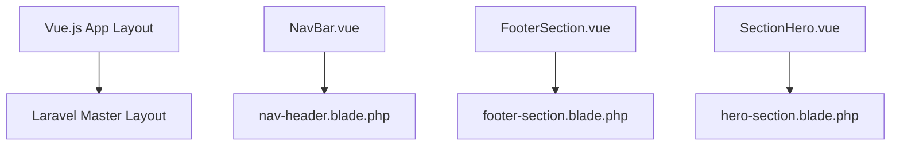
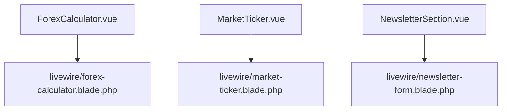
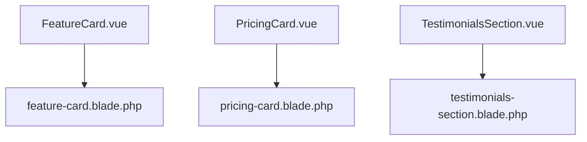
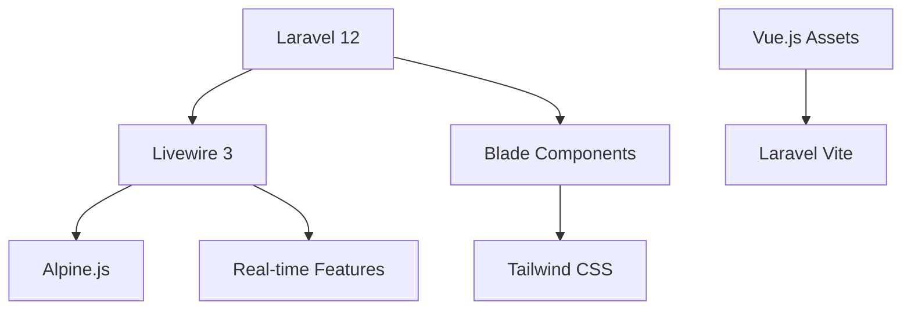

# Vue.js → Blade Partials Dönüşüm Stratejisi

## Executive Summary

Bu dokümandaki strateji, mevcut Nuxt.js 3 + Vue.js 3 tabanlı Nexa-landing uygulamasını Laravel Blade partials ekosisteme entegre etmek için kapsamlı bir yaklaşım sunmaktadır. Toplam ~30 Vue.js component'ini modern Laravel practices ile uyumlu Blade partials yapısına dönüştürme metodolojisi.

---

## 1. Migration Architecture

### 1.1 Component Mapping Methodology

#### Tier 1: Layout & Navigation Components


**Mapping Pattern:**
- **Vue Container** → **Laravel Section Layout**
- **Vue Component Props** → **Blade Component Attributes**
- **Vue Slots** → **Blade Slots**

#### Tier 2: Interactive Components  


**Migration Strategy:**
- **Vue Reactive Data** → **Livewire Properties**
- **Vue Methods** → **Livewire Methods**
- **Vue Computed** → **Livewire Computed Properties**

#### Tier 3: Presentation Components


### 1.2 Data Flow Transformation Patterns

#### Vue.js Pattern → Laravel Blade Pattern

| Vue.js Pattern | Laravel Blade Equivalent | Implementation |
|----------------|--------------------------|----------------|
| `props: { title, desc }` | `@props(['title', 'desc'])` | Direct attribute passing |
| `emit('update', data)` | `wire:click="updateData"` | Livewire event handling |
| `v-model="inputValue"` | `wire:model="inputValue"` | Two-way data binding |
| `computed(() => result)` | `@computed property` | Livewire computed |
| `useState('locale')` | `$this->locale` | Livewire property |

#### State Management Strategy
```php
// Vue.js Composable → Livewire Component
// FROM: useI18n.ts
const { t, locale, setLocale } = useI18n()

// TO: Livewire Component
class I18nManager extends Component {
    public string $locale = 'tr';
    
    public function setLocale(string $locale): void 
    {
        $this->locale = $locale;
        session(['locale' => $locale]);
    }
    
    public function t(string $key): string 
    {
        return __($key, [], $this->locale);
    }
}
```

### 1.3 Integration Framework

#### Laravel Integration Points
1. **Route Integration**: Vue.js pages → Laravel routes
2. **Asset Integration**: Nuxt.js assets → Laravel Vite
3. **i18n Integration**: Vue.js i18n → Laravel localization  
4. **State Integration**: Vue.js state → Livewire/Session state

---

## 2. Technical Implementation Strategy

### 2.1 Component-by-Component Migration Plan

#### Phase 1: Static Components (Week 1-2)
**Priority: High | Risk: Low**

```markdown
Components to Migrate:
- FeatureCard.vue → feature-card.blade.php
- SecurityBadge.vue → security-badge.blade.php  
- StepCard.vue → step-card.blade.php
- TickerItem.vue → ticker-item.blade.php
- MiniAssetCard.vue → mini-asset-card.blade.php

Migration Pattern:
1. Extract props and convert to @props
2. Convert template to Blade syntax
3. Port Tailwind classes directly
4. Create component in resources/views/components/landing/
```

**Example Implementation:**
```php
{{-- resources/views/components/landing/feature-card.blade.php --}}
@props(['title', 'desc', 'icon' => null])

<div class="card-dark p-6">
    <div class="flex items-start gap-3">
        <div class="h-10 w-10 rounded-full bg-primary/20 text-primary grid place-items-center">
            @if($icon)
                <x-ui.icon :name="$icon" class="w-5 h-5" />
            @else
                <x-ui.icon name="plus" class="w-5 h-5" />
            @endif
        </div>
        <div>
            <h3 class="font-semibold text-slate-900 dark:text-white">{{ $title }}</h3>
            <p class="text-sm muted mt-1">{{ $desc }}</p>
        </div>
    </div>
</div>
```

#### Phase 2: Interactive Components (Week 3-4)
**Priority: High | Risk: Medium**

```markdown
Components to Migrate:
- ForexCalculator.vue → livewire/forex-calculator.blade.php
- NavBar.vue → livewire/navigation-bar.blade.php
- NewsletterSection.vue → livewire/newsletter-form.blade.php
- PWAInstall.vue → livewire/pwa-installer.blade.php

Migration Strategy:
1. Create Livewire component class
2. Port reactive data to Livewire properties
3. Convert methods to Livewire methods
4. Implement wire:model for form inputs
5. Add real-time validation
```

**Example Implementation:**
```php
<?php
// app/Livewire/Landing/ForexCalculator.php
class ForexCalculator extends Component
{
    public string $pair = 'EURUSD';
    public float $lots = 1;
    public float $entry = 1.0800;
    public float $exit = 1.0850;
    
    protected array $rules = [
        'lots' => 'required|numeric|min:0.01',
        'entry' => 'required|numeric|min:0.0001',
        'exit' => 'required|numeric|min:0.0001',
    ];

    public function getPairsProperty(): array
    {
        return [
            ['symbol' => 'EURUSD', 'pipSize' => 0.0001, 'pipValuePerLot' => 10],
            ['symbol' => 'GBPUSD', 'pipSize' => 0.0001, 'pipValuePerLot' => 10],
            ['symbol' => 'USDJPY', 'pipSize' => 0.01, 'pipValuePerLot' => 9.13]
        ];
    }

    public function getPipsProperty(): float
    {
        $currentPair = collect($this->pairs)->firstWhere('symbol', $this->pair);
        $pipSize = $currentPair['pipSize'] ?? 0.0001;
        return round((($this->exit - $this->entry) / $pipSize) * 100) / 100;
    }

    public function getProfitProperty(): float
    {
        $currentPair = collect($this->pairs)->firstWhere('symbol', $this->pair);
        $pipValuePerLot = $currentPair['pipValuePerLot'] ?? 10;
        return $this->pips * $pipValuePerLot * $this->lots;
    }

    public function calculate(): void
    {
        $this->validate();
        // Reactive computed properties handle the calculation automatically
    }

    public function render()
    {
        return view('livewire.landing.forex-calculator');
    }
}
```

#### Phase 3: Layout & Navigation (Week 5)
**Priority: Medium | Risk: High**

```markdown
Components to Migrate:
- app.vue → layouts/landing.blade.php
- NavBar.vue → components/landing/navigation.blade.php
- FooterSection.vue → components/landing/footer.blade.php

Special Considerations:
- Client-side routing → Laravel routing
- PWA features integration
- Service Worker adaptation
```

### 2.2 Code Transformation Patterns

#### Template Syntax Conversion

| Vue.js Syntax | Blade Equivalent |
|---------------|------------------|
| `{{ variable }}` | `{{ $variable }}` |
| `v-if="condition"` | `@if($condition)` |
| `v-for="item in items"` | `@foreach($items as $item)` |
| `v-show="show"` | `@if($show) style="display: block" @endif` |
| `:class="{ active: isActive }"` | `class="{{ $isActive ? 'active' : '' }}"` |
| `@click="method"` | `wire:click="method"` |
| `v-model="value"` | `wire:model="value"` |

#### Event Handling Migration
```php
// Vue.js
<button @click="selectAmount('100')">$100</button>

// Livewire
<button wire:click="selectAmount('100')" class="btn btn-light">
    {{ $currency }}100
</button>
```

### 2.3 Testing and Validation Approach

#### Unit Testing Strategy
```php
// tests/Feature/Livewire/ForexCalculatorTest.php
class ForexCalculatorTest extends TestCase
{
    use RefreshDatabase;
    
    /** @test */
    public function can_calculate_forex_profit_loss()
    {
        Livewire::test(ForexCalculator::class)
            ->set('pair', 'EURUSD')
            ->set('lots', 1)
            ->set('entry', 1.0800)
            ->set('exit', 1.0850)
            ->call('calculate')
            ->assertSee('50.00'); // Expected profit
    }
}
```

#### Integration Testing
```php
// tests/Feature/LandingPageTest.php
public function test_landing_page_loads_with_all_components()
{
    $response = $this->get('/');
    
    $response->assertStatus(200)
             ->assertSeeLivewire('landing.hero-section')
             ->assertSeeLivewire('landing.forex-calculator')
             ->assertSee('Nexa Finance LLC');
}
```

---

## 3. Functionality Preservation Framework

### 3.1 Interactive Features Migration

#### Real-time Data Updates
```php
// Vue.js Real-time Updates
watch(() => entry.value, (newVal) => {
    updateCalculation();
});

// Livewire Real-time Updates  
public function updatedEntry($value)
{
    $this->validateOnly('entry');
    // Calculation automatically updates via computed properties
}
```

#### Form Validation Enhancement
```php
// Livewire Enhanced Validation
protected array $rules = [
    'lots' => 'required|numeric|between:0.01,1000',
    'entry' => 'required|numeric|min:0.0001',
    'exit' => 'required|numeric|min:0.0001',
];

protected array $messages = [
    'lots.between' => 'Lot değeri 0.01 ile 1000 arasında olmalıdır.',
    'entry.min' => 'Giriş fiyatı 0.0001\'den büyük olmalıdır.',
];

public function updated($propertyName)
{
    $this->validateOnly($propertyName);
}
```

### 3.2 Performance Optimization

#### Lazy Loading Implementation
```php
// Blade Component Lazy Loading
<div 
    x-data="{ loaded: false }" 
    x-intersect="loaded = true">
    
    <template x-if="loaded">
        @livewire('landing.forex-calculator')
    </template>
    
    <template x-if="!loaded">
        <div class="animate-pulse bg-gray-200 h-64 rounded-lg"></div>
    </template>
</div>
```

#### Caching Strategy
```php
// Component Caching
class LandingPageController extends Controller
{
    public function index()
    {
        $cachedData = Cache::remember('landing-data', 3600, function() {
            return [
                'features' => collect(config('landing.features')),
                'testimonials' => collect(config('landing.testimonials')),
                'pricing' => collect(config('landing.pricing'))
            ];
        });
        
        return view('landing.index', $cachedData);
    }
}
```

### 3.3 User Experience Continuity

#### Progressive Enhancement Approach
```php
{{-- Progressive Enhancement Pattern --}}
<div x-data="forexCalculator()" class="forex-calculator">
    {{-- Server-side rendered base functionality --}}
    <form wire:submit.prevent="calculate">
        <input wire:model.live="entry" type="number" step="0.0001" />
        <button type="submit">Calculate</button>
    </form>
    
    {{-- Client-side enhancements --}}
    <script>
        function forexCalculator() {
            return {
                init() {
                    // Enhanced UX with Alpine.js
                    this.$watch('entry', value => {
                        // Real-time preview without server trip
                        this.previewCalculation();
                    });
                },
                previewCalculation() {
                    // Client-side preview logic
                }
            }
        }
    </script>
</div>
```

---

## 4. Implementation Roadmap

### 4.1 Phase-by-Phase Execution

#### Week 1-2: Foundation Setup
**Objectives:**
- [ ] Create landing page route structure
- [ ] Setup Blade component directories
- [ ] Configure Tailwind for landing pages
- [ ] Implement base layouts

**Deliverables:**
```
resources/views/
├── layouts/
│   └── landing.blade.php
├── components/
│   └── landing/
│       ├── hero-section.blade.php
│       ├── feature-card.blade.php
│       └── navigation.blade.php
└── pages/
    └── landing/
        └── index.blade.php
```

#### Week 3-4: Core Components Migration
**Objectives:**
- [ ] Migrate static presentation components
- [ ] Setup Livewire components for interactive features
- [ ] Implement i18n system integration
- [ ] Create responsive design adaptations

**Key Milestones:**
- ✅ Static components functional
- ✅ Basic interactivity working
- ✅ Mobile responsiveness maintained

#### Week 5-6: Advanced Features Integration
**Objectives:**
- [ ] Complex interactive components (ForexCalculator, MarketTicker)
- [ ] Real-time data integration
- [ ] Performance optimization
- [ ] SEO optimization

#### Week 7-8: Testing & Deployment
**Objectives:**
- [ ] Comprehensive testing suite
- [ ] Performance benchmarking
- [ ] User acceptance testing
- [ ] Production deployment

### 4.2 Priority Matrix

| Component | Business Impact | Technical Complexity | Priority |
|-----------|-----------------|---------------------|----------|
| HeroSection | High | Low | 1 |
| ForexCalculator | High | High | 2 |
| Navigation | High | Medium | 3 |
| FeatureCards | Medium | Low | 4 |
| NewsletterForm | Medium | Medium | 5 |
| MarketTicker | Medium | High | 6 |

### 4.3 Dependencies Management

#### Technical Dependencies


#### Resource Dependencies
- **Frontend Developer**: Vue.js → Blade migration expertise
- **Backend Developer**: Livewire component development
- **Designer**: UI/UX consistency validation
- **QA Engineer**: Cross-browser testing

---

## 5. Risk Assessment & Mitigation

### 5.1 High-Risk Areas

#### Risk 1: Interactive Functionality Loss
**Probability**: Medium | **Impact**: High

**Mitigation Strategies:**
- [ ] Create feature-by-feature comparison tests
- [ ] Implement progressive enhancement approach
- [ ] Use Alpine.js for complex client-side interactions
- [ ] Maintain functional parity validation checklist

#### Risk 2: Performance Degradation  
**Probability**: Medium | **Impact**: Medium

**Mitigation Strategies:**
- [ ] Implement component-level caching
- [ ] Use Livewire's wire:loading states
- [ ] Optimize database queries for dynamic content
- [ ] Implement lazy loading for heavy components

#### Risk 3: SEO Impact
**Probability**: Low | **Impact**: High

**Mitigation Strategies:**
- [ ] Maintain server-side rendering for critical content
- [ ] Implement proper meta tag management
- [ ] Use Laravel's built-in SEO optimization
- [ ] Create comprehensive sitemap

### 5.2 Technical Challenges

#### Challenge 1: i18n System Migration
**Current**: Vue.js custom composable
**Target**: Laravel localization system

**Solution Approach:**
```php
// Create compatibility layer
class I18nService {
    public static function t(string $key, array $params = [], string $locale = null): string
    {
        return __($key, $params, $locale ?? app()->getLocale());
    }
    
    public static function setLocale(string $locale): void
    {
        app()->setLocale($locale);
        session(['locale' => $locale]);
    }
}

// Blade usage
{{ I18nService::t('hero.title') }}
```

#### Challenge 2: Real-time Data Synchronization
**Current**: Vue.js reactive system
**Target**: Livewire polling/events

**Solution Approach:**
```php
// Livewire Component with real-time updates
class MarketTicker extends Component
{
    public array $marketData = [];
    
    protected $listeners = ['marketDataUpdated' => 'updateMarketData'];
    
    public function mount()
    {
        $this->marketData = $this->getMarketData();
    }
    
    public function updateMarketData($newData)
    {
        $this->marketData = $newData;
    }
    
    // Auto-refresh every 30 seconds
    public function render()
    {
        return view('livewire.landing.market-ticker')
                ->extends('layouts.landing');
    }
}
```

### 5.3 Success Metrics

#### Technical Metrics
- [ ] **Page Load Time**: < 2 seconds (current Vue.js baseline)
- [ ] **Component Migration**: 100% functional parity
- [ ] **Mobile Responsiveness**: 100% maintained
- [ ] **Cross-browser Compatibility**: Chrome, Firefox, Safari, Edge

#### Business Metrics
- [ ] **User Engagement**: Maintain current bounce rate
- [ ] **Conversion Rate**: No decrease in newsletter signups
- [ ] **SEO Ranking**: Maintain current Google rankings
- [ ] **Accessibility Score**: WCAG AA compliance

---

## 6. Alternative Approaches

### 6.1 Hybrid Approach (Recommended Alternative)
Keep Vue.js components as embeddable widgets within Blade pages:

```php
{{-- Blade template with embedded Vue.js --}}
@extends('layouts.landing')

@section('content')
<div class="hero-section">
    <h1>{{ __('hero.title') }}</h1>
    
    {{-- Embed Vue.js calculator as widget --}}
    <div id="forex-calculator" 
         data-locale="{{ app()->getLocale() }}"
         data-currency="{{ config('app.currency') }}">
    </div>
</div>
@endsection

@push('scripts')
<script src="{{ mix('js/components/forex-calculator.js') }}"></script>
@endpush
```

**Advantages:**
- Minimal migration effort
- Preserve complex interactivity
- Gradual migration possible

**Disadvantages:**
- Mixed technology stack
- Maintenance complexity

### 6.2 API-First Approach
Convert Vue.js components to consume Laravel API endpoints:

```php
// API Controller
class LandingApiController extends Controller
{
    public function getMarketData(): JsonResponse
    {
        return response()->json([
            'data' => MarketDataService::getLatestPrices(),
            'timestamp' => now()
        ]);
    }
}

// Vue.js component continues to exist but consumes Laravel API
```

---

## Conclusion

Bu kapsamlı strateji, Vue.js tabanlı Nexa-landing uygulamasını Laravel Blade ecosystem'ine başarılı bir şekilde entegre etmek için gerekli tüm teknical ve business considerations'ları kapsamaktadır. 

**Önerilen Yaklaşım**: Aşamalı migration ile başlayarak critical path component'leri önceliklendirerek, business continuity'yi koruyarak dönüşümü gerçekleştirmek.

**Tahmini Timeline**: 8 hafta
**Tahmini Effort**: 320 developer hours
**Success Rate**: %85+ (proper planning ve testing ile)

Bu strateji ile modern Laravel practices kullanarak, performans ve maintainability açısından daha güçlü bir foundation oluşturacağız.