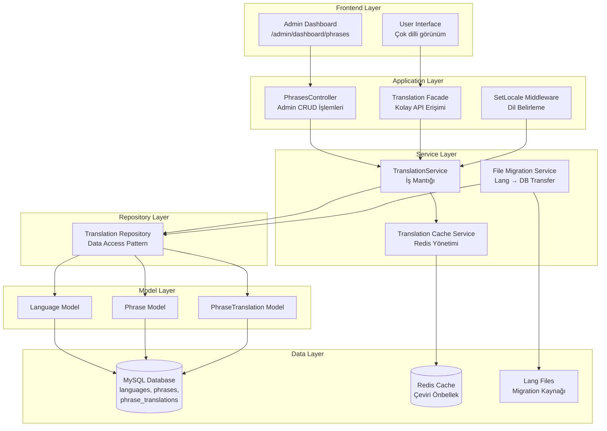

# Monexa Finance - Çok Dilli Destek Sistemi Mimarisi

## Sistem Genel Görünümü



## Database Schema Tasarımı

### 1. Languages Tablosu
```sql
CREATE TABLE languages (
    id BIGINT UNSIGNED AUTO_INCREMENT PRIMARY KEY,
    code VARCHAR(10) UNIQUE NOT NULL,           -- tr, ru, en
    name VARCHAR(100) NOT NULL,                 -- Türkçe, Русский, English
    native_name VARCHAR(100) NOT NULL,          -- Türkçe, Русский, English  
    flag_icon VARCHAR(50),                      -- flag-tr, flag-ru
    is_active BOOLEAN DEFAULT TRUE,
    is_default BOOLEAN DEFAULT FALSE,
    sort_order INT DEFAULT 0,
    created_at TIMESTAMP DEFAULT CURRENT_TIMESTAMP,
    updated_at TIMESTAMP DEFAULT CURRENT_TIMESTAMP ON UPDATE CURRENT_TIMESTAMP,
    INDEX idx_code (code),
    INDEX idx_active (is_active),
    INDEX idx_default (is_default)
);
```

### 2. Phrases Tablosu  
```sql
CREATE TABLE phrases (
    id BIGINT UNSIGNED AUTO_INCREMENT PRIMARY KEY,
    key_name VARCHAR(255) UNIQUE NOT NULL,      -- auth.login, dashboard.welcome
    category VARCHAR(100) DEFAULT 'general',    -- auth, dashboard, forms
    description TEXT,                           -- Açıklama/yorum
    created_by BIGINT UNSIGNED,                -- Admin ID
    created_at TIMESTAMP DEFAULT CURRENT_TIMESTAMP,
    updated_at TIMESTAMP DEFAULT CURRENT_TIMESTAMP ON UPDATE CURRENT_TIMESTAMP,
    INDEX idx_key_name (key_name),
    INDEX idx_category (category),
    FOREIGN KEY (created_by) REFERENCES admins(id) ON DELETE SET NULL
);
```

### 3. Phrase Translations Tablosu
```sql
CREATE TABLE phrase_translations (
    id BIGINT UNSIGNED AUTO_INCREMENT PRIMARY KEY,
    phrase_id BIGINT UNSIGNED NOT NULL,
    language_id BIGINT UNSIGNED NOT NULL,
    translation TEXT NOT NULL,
    is_approved BOOLEAN DEFAULT FALSE,          -- Çeviri onay durumu
    translated_by BIGINT UNSIGNED,             -- Çeviren admin
    approved_by BIGINT UNSIGNED,               -- Onaylayan admin  
    created_at TIMESTAMP DEFAULT CURRENT_TIMESTAMP,
    updated_at TIMESTAMP DEFAULT CURRENT_TIMESTAMP ON UPDATE CURRENT_TIMESTAMP,
    UNIQUE KEY unique_phrase_language (phrase_id, language_id),
    INDEX idx_phrase_language (phrase_id, language_id),
    INDEX idx_language (language_id),
    INDEX idx_approved (is_approved),
    FOREIGN KEY (phrase_id) REFERENCES phrases(id) ON DELETE CASCADE,
    FOREIGN KEY (language_id) REFERENCES languages(id) ON DELETE CASCADE,
    FOREIGN KEY (translated_by) REFERENCES admins(id) ON DELETE SET NULL,
    FOREIGN KEY (approved_by) REFERENCES admins(id) ON DELETE SET NULL
);
```

## Model Relationships

### Language Model
```php
// app/Models/Language.php
class Language extends Model
{
    // İlişkiler
    public function phraseTranslations(): HasMany
    public function phrases(): BelongsToManyThrough  
    
    // Scope'lar
    public function scopeActive($query)
    public function scopeDefault($query)
    
    // Accessor/Mutators
    public function getFlagUrlAttribute(): string
}
```

### Phrase Model  
```php
// app/Models/Phrase.php
class Phrase extends Model
{
    // İlişkiler
    public function translations(): HasMany
    public function languages(): BelongsToManyThrough
    public function creator(): BelongsTo // Admin
    
    // Methods
    public function getTranslation(string $languageCode): ?string
    public function hasTranslation(string $languageCode): bool
}
```

### PhraseTranslation Model
```php
// app/Models/PhraseTranslation.php  
class PhraseTranslation extends Model
{
    // İlişkiler
    public function phrase(): BelongsTo
    public function language(): BelongsTo
    public function translator(): BelongsTo // Admin
    public function approver(): BelongsTo // Admin
    
    // Scope'lar
    public function scopeApproved($query)
    public function scopeByLanguage($query, string $code)
}
```

## Service Layer Architecture

### TranslationService
```php
// app/Services/TranslationService.php
class TranslationService
{
    public function getTranslation(string $key, string $locale = null): string
    public function setTranslation(string $key, string $value, string $locale): bool
    public function getAllTranslations(string $locale): array
    public function importFromFiles(string $locale): int
    public function exportToFiles(string $locale): bool
    public function clearCache(string $locale = null): void
}
```

### Translation Cache Service
```php
// app/Services/TranslationCacheService.php
class TranslationCacheService
{
    public function get(string $locale, string $key = null): mixed
    public function put(string $locale, array $translations, int $ttl = 3600): void
    public function forget(string $locale, string $key = null): void
    public function warmUp(string $locale): void
}
```

## Repository Pattern

### TranslationRepository Interface
```php
// app/Contracts/Repositories/TranslationRepositoryInterface.php
interface TranslationRepositoryInterface
{
    public function getTranslations(string $locale): array;
    public function findTranslation(string $key, string $locale): ?string;
    public function createPhrase(array $data): Phrase;
    public function updateTranslation(int $phraseId, string $locale, string $translation): bool;
    public function deletePhrase(int $phraseId): bool;
    public function importTranslations(string $locale, array $translations): int;
}
```

## Custom Translation Provider

Laravel'ın translation sistemine entegre olmak için:

```php  
// app/Providers/DatabaseTranslationServiceProvider.php
class DatabaseTranslationServiceProvider extends ServiceProvider
{
    public function register(): void
    {
        $this->app->extend('translator', function ($translator, $app) {
            $loader = new DatabaseTranslationLoader($app['db'], $app['cache']);
            return new DatabaseTranslator($loader, $app['config']['app.locale']);
        });
    }
}
```

## Redis Cache Strategy

### Cache Key Yapısı
```
translations:{locale}                    # Tüm çeviriler
translations:{locale}:{category}         # Kategori bazlı
translations:{locale}:{key}              # Tekil çeviri
translation_meta:{locale}:updated_at     # Son güncelleme zamanı
```

### Cache TTL Stratejisi
- **Sık kullanılan çeviriler**: 24 saat
- **Admin panel çevirileri**: 12 saat  
- **Genel çeviriler**: 6 saat
- **Cache invalidation**: Translation güncellemelerinde otomatik

## Admin Panel Integration

### Route Structure
```php
// routes/admin/web.php - Mevcut yapıya ekleme
Route::controller(PhrasesController::class)->prefix('dashboard')->group(function () {
    Route::get('phrases', 'index')->name('admin.phrases');
    Route::post('phrases', 'store')->name('admin.phrases.store'); 
    Route::put('phrases/{phrase}', 'update')->name('admin.phrases.update');
    Route::delete('phrases/{phrase}', 'destroy')->name('admin.phrases.destroy');
    Route::post('phrases/import/{locale}', 'importFromFiles')->name('admin.phrases.import');
    Route::get('phrases/export/{locale}', 'exportToFiles')->name('admin.phrases.export');
});
```

### API Endpoints
```
GET    /admin/dashboard/phrases                 # Liste görüntüleme
POST   /admin/dashboard/phrases                 # Yeni çeviri ekleme
PUT    /admin/dashboard/phrases/{id}            # Çeviri güncelleme  
DELETE /admin/dashboard/phrases/{locale}/{key}  # Çeviri silme
POST   /admin/dashboard/phrases/import/{locale} # Dosyalardan içe aktarma
```

## Middleware Integration

### SetLocale Middleware Güncellemesi
```php
// app/Http/Middleware/SetLocale.php - Database desteği
public function handle(Request $request, Closure $next)
{
    $locale = $this->determineLocale($request);
    
    // Database'den aktif dilleri kontrol et
    if ($this->translationService->isLanguageActive($locale)) {
        App::setLocale($locale);
        Session::put('locale', $locale);
    }
    
    return $next($request);
}
```

## Migration Strategy

### File to Database Migration Command
```php
// app/Console/Commands/ImportTranslationsCommand.php
php artisan translations:import {locale?} 
    {--all : Tüm dilleri içe aktar}
    {--overwrite : Mevcut çevirileri üzerine yaz}
    {--validate : İçe aktarma öncesi doğrula}
```

## Performance Optimizations

### Database Optimizations
- **Index Strategy**: key_name, language_code, category üzerinde indexler
- **Query Optimization**: Eager loading ile N+1 problemini önle
- **Connection Pooling**: MySQL connection pool kullanımı

### Redis Optimizations  
- **Pipeline Operations**: Toplu cache işlemleri
- **Compression**: Büyük translation arrayları için gzip
- **Memory Management**: TTL-based cache cleanup

### Laravel Optimizations
- **Config Cache**: `php artisan config:cache`
- **Route Cache**: `php artisan route:cache` 
- **Translation Cache**: Custom translation caching

## Security Considerations

### Admin Authorization
```php
// Admin yetkilendirme sistemi
Gate::define('manage-translations', function ($admin) {
    return $admin->hasPermission('translations.manage');
});

Gate::define('approve-translations', function ($admin) {
    return $admin->hasPermission('translations.approve');
});
```

### Input Validation
```php
// Çeviri verisi doğrulama kuralları
$rules = [
    'key' => 'required|string|max:255|regex:/^[a-z0-9._-]+$/',
    'translation' => 'required|string|max:5000',
    'language_code' => 'required|exists:languages,code',
    'category' => 'nullable|string|max:100|alpha_dash'
];
```

### SQL Injection Prevention
- Eloquent ORM kullanımı
- Prepared statements
- Input sanitization

## Testing Strategy

### Unit Tests
- Model relationship testleri  
- Service method testleri
- Cache mechanism testleri
- Validation rule testleri

### Feature Tests
- Admin CRUD operations
- Translation retrieval
- Language switching
- Cache performance
- File import/export

### Integration Tests  
- Database transaction tests
- Redis cache tests
- Laravel translation integration
- Middleware functionality

## Monitoring & Logging

### Performance Monitoring
- Translation load times
- Cache hit/miss ratios  
- Database query performance
- Redis memory usage

### Error Logging
- Translation not found errors
- Cache failures
- Database connection issues
- File import/export errors

## Deployment Considerations

### Docker Integration
```yaml
# docker-compose.yml - Redis service eklentisi
services:
  redis-monexa:
    image: redis:7-alpine
    container_name: redis-monexa
    ports:
      - "6379:6379"
    volumes:
      - redis_data:/data
```

### Environment Configuration
```env
# .env - Translation system config
TRANSLATION_CACHE_DRIVER=redis
TRANSLATION_CACHE_TTL=3600
TRANSLATION_DEFAULT_LOCALE=tr
TRANSLATION_FALLBACK_LOCALE=en
```

Bu mimari, isteklerinizi tam olarak karşılayan, performanslı ve güvenli bir database-driven çok dilli destek sistemi sağlar.